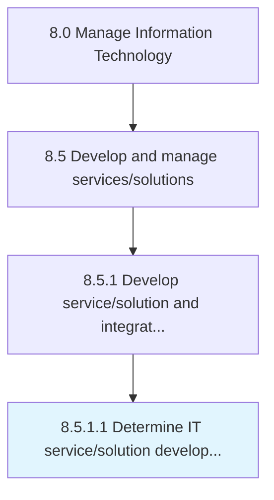

# Determine IT service/solution development

> Determining the development of IT service/solution.

## Overview

Activity 8.5.1.1 is an activity within the Manage Information Technology framework. 

Determining the development of IT service/solution. Analyze the pros and cons of IT service/solution and it's methods on the basis of their cost effectiveness and development value.

## Process Hierarchy



## Key Statistics

| Metric | Value |
|--------|-------|
| APQC Code | 20786 |
| Hierarchy ID | 8.5.1.1 |
| Level | Activity |
| Parent | [8.5.1](../) |
| Sub-Processes | 0 |


## GraphDL Semantic Structure

```
determine.ITServicesolutionDevelopment
```

| Component | Value | Description |
|-----------|-------|-------------|
| Verb | `determine` | Primary action |
| Object | `IT service/solution development` | Direct object |


## Related Concepts

- ITServiceDevelopment
- ITSolutionDevelopment


---

*Source: APQC PCF 20786 (8.5.1.1) - APQC*
