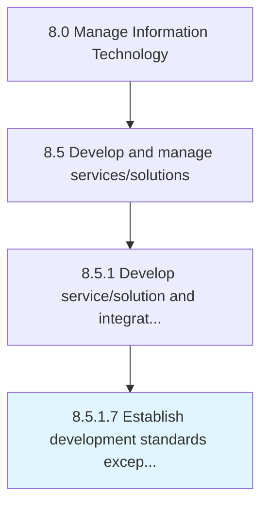

# Establish development standards exception governance

> Creating standards and procedures for developing IT services/solutions outside of defined business parameters.

## Overview

Activity 8.5.1.7 is an activity within the Manage Information Technology framework. 

Creating standards and procedures for developing IT services/solutions outside of defined business parameters.

## Process Hierarchy



## Key Statistics

| Metric | Value |
|--------|-------|
| APQC Code | 20792 |
| Hierarchy ID | 8.5.1.7 |
| Level | Activity |
| Parent | [8.5.1](../) |
| Sub-Processes | 0 |


## GraphDL Semantic Structure

```
establish.DevelopmentStandardsExceptionGovernance
```

| Component | Value | Description |
|-----------|-------|-------------|
| Verb | `establish` | Primary action |
| Object | `development standards exception governance` | Direct object |


## Related Concepts

- [DevelopmentStandardsExceptionGovernance](/concepts/DevelopmentStandardsExceptionGovernance)


---

*Source: APQC PCF 20792 (8.5.1.7) - APQC*
