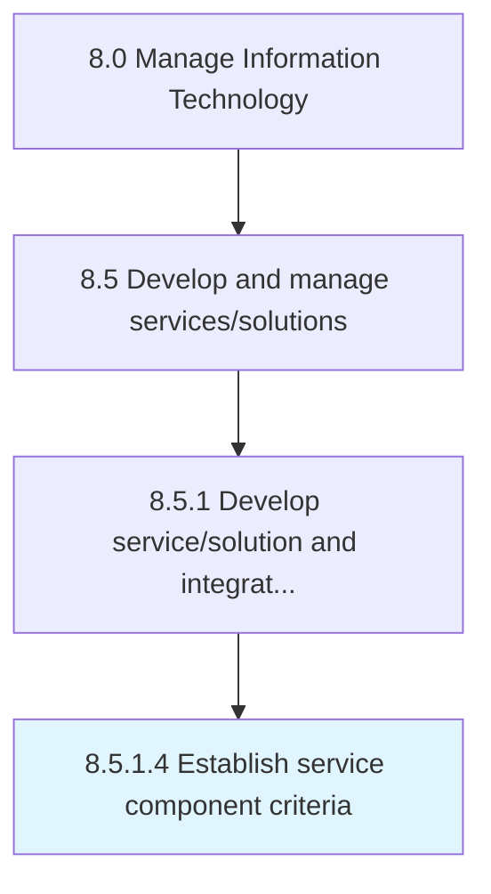

# Establish service component criteria

> Establishing standards for selection of IT service components.

## Overview

Activity 8.5.1.4 is an activity within the Manage Information Technology framework. 

Establishing standards for selection of IT service components.

## Process Hierarchy



## Key Statistics

| Metric | Value |
|--------|-------|
| APQC Code | 20789 |
| Hierarchy ID | 8.5.1.4 |
| Level | Activity |
| Parent | [8.5.1](../) |
| Sub-Processes | 0 |


## GraphDL Semantic Structure

```
establish.ServiceComponentCriteria
```

| Component | Value | Description |
|-----------|-------|-------------|
| Verb | `establish` | Primary action |
| Object | `service component criteria` | Direct object |


## Related Concepts

- ServiceComponentCriteria


---

*Source: APQC PCF 20789 (8.5.1.4) - APQC*
