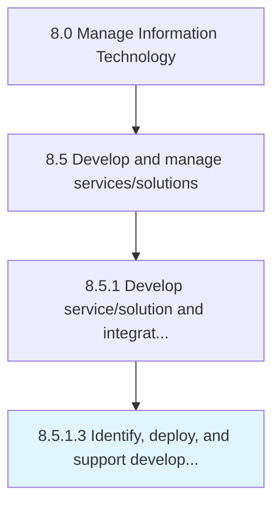

# Identify, deploy, and support development methodologies and tools

> Identifying and implementing techniques and tools for development based on overall value addition to the IT environment.

## Overview

Activity 8.5.1.3 is an activity within the Manage Information Technology framework. 

Identifying and implementing techniques and tools for development based on overall value addition to the IT environment.

## Process Hierarchy



## Key Statistics

| Metric | Value |
|--------|-------|
| APQC Code | 20788 |
| Hierarchy ID | 8.5.1.3 |
| Level | Activity |
| Parent | [8.5.1](../) |
| Sub-Processes | 0 |


## GraphDL Semantic Structure

```
identify,.DeployAndSupportDevelopmentMethodologiesAndTools
```

| Component | Value | Description |
|-----------|-------|-------------|
| Verb | `identify,` | Primary action |
| Object | `deploy, and support development methodologies and tools` | Direct object |


## Related Concepts

- [DevelopmentMethodologies](/concepts/DevelopmentMethodologies)
- [Tools](/concepts/Tools)
- [DevelopmentMethodologies](/concepts/DevelopmentMethodologies)
- [Tools](/concepts/Tools)
- [DevelopmentMethodologies](/concepts/DevelopmentMethodologies)
- [Tools](/concepts/Tools)


---

*Source: APQC PCF 20788 (8.5.1.3) - APQC*
