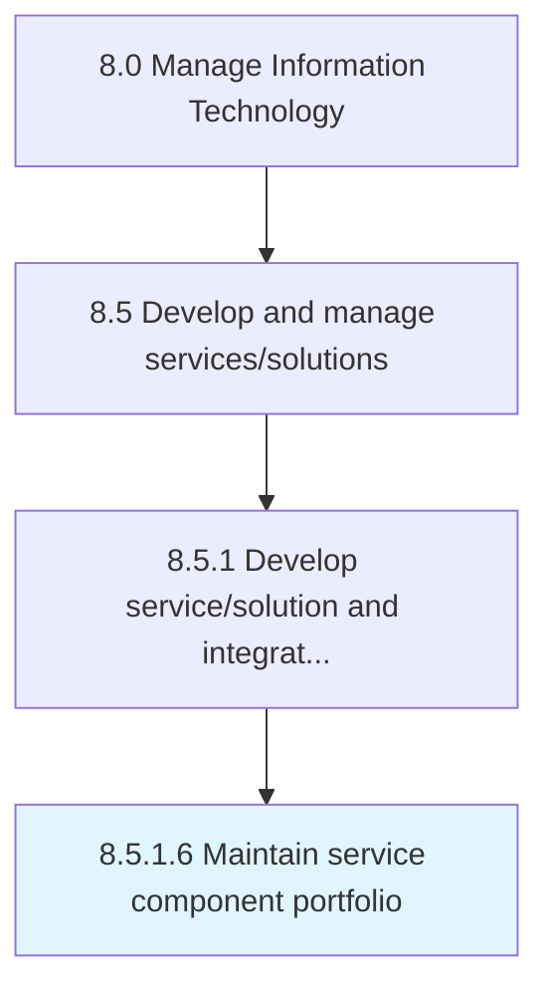

# Maintain service component portfolio

> Creating and establishing service component portfolio by defining investments, and activities.

## Overview

Activity 8.5.1.6 is an activity within the Manage Information Technology framework. 

Creating and establishing service component portfolio by defining investments, and activities. Analyze and examine the value of the service component portfolio, and allocate resources towards it.

## Process Hierarchy



## Key Statistics

| Metric | Value |
|--------|-------|
| APQC Code | 20791 |
| Hierarchy ID | 8.5.1.6 |
| Level | Activity |
| Parent | [8.5.1](../) |
| Sub-Processes | 0 |


## GraphDL Semantic Structure

```
maintain.ServiceComponentPortfolio
```

| Component | Value | Description |
|-----------|-------|-------------|
| Verb | `maintain` | Primary action |
| Object | `service component portfolio` | Direct object |


## Related Concepts

- ServiceComponentPortfolio


---

*Source: APQC PCF 20791 (8.5.1.6) - APQC*
