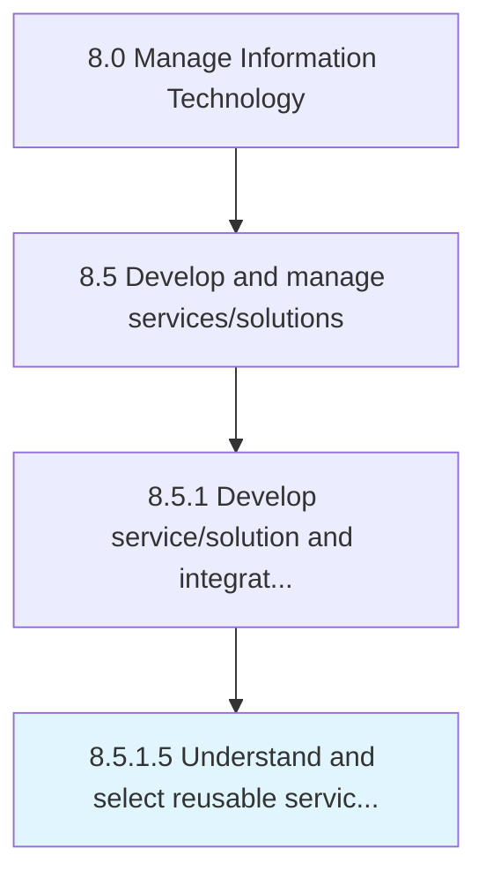

# Understand and select reusable service components

> Understanding and selecting reusable service components so that they can be cost-effective and efficient.

## Overview

Activity 8.5.1.5 is an activity within the Manage Information Technology framework. 

Understanding and selecting reusable service components so that they can be cost-effective and efficient.

## Process Hierarchy



## Key Statistics

| Metric | Value |
|--------|-------|
| APQC Code | 20790 |
| Hierarchy ID | 8.5.1.5 |
| Level | Activity |
| Parent | [8.5.1](../) |
| Sub-Processes | 0 |


## GraphDL Semantic Structure

```
understand.AndSelectReusableServiceComponents
```

| Component | Value | Description |
|-----------|-------|-------------|
| Verb | `understand` | Primary action |
| Object | `and select reusable service components` | Direct object |


## Related Concepts

- [ReusableServiceComponents](/concepts/ReusableServiceComponents)
- [ReusableServiceComponents](/concepts/ReusableServiceComponents)


---

*Source: APQC PCF 20790 (8.5.1.5) - APQC*
