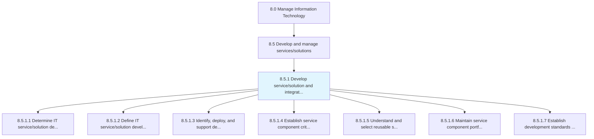
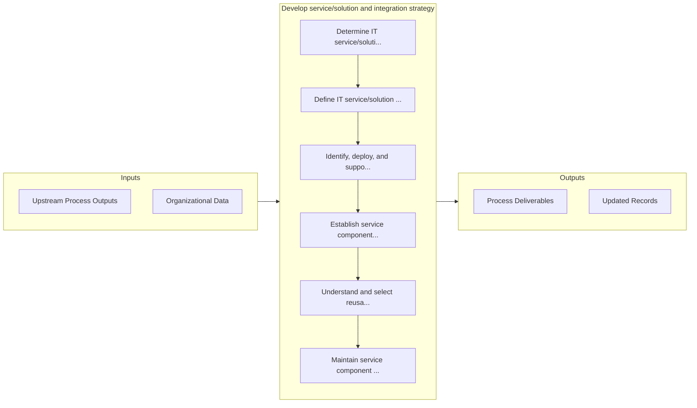

# Develop service/solution and integration strategy

> Developing service/solution along with creating a strategy that provides a base for delivering service/solution aligned with overall business needs.

## Overview

Process 8.5.1 is a core process that defines the specific procedures for develop service/solution and integration strategy. 

Developing service/solution along with creating a strategy that provides a base for delivering service/solution aligned with overall business needs. Conduct research within the services/solutions field for development and integration.

## Process Hierarchy



## Key Statistics

| Metric | Value |
|--------|-------|
| APQC Code | 20785 |
| Hierarchy ID | 8.5.1 |
| Level | Process |
| Parent | [8.5](../) |
| Sub-Processes | 7 |


## GraphDL Semantic Structure

```
develop.ServicesolutionAndIntegrationStrategy
```

| Component | Value | Description |
|-----------|-------|-------------|
| Verb | `develop` | Primary action |
| Object | `service/solution and integration strategy` | Direct object |


## Process Flow



## Sub-Processes

| Process | Hierarchy ID | Description |
|---------|-------------|-------------|
| [Determine IT service/solution development](./DetermineITServicesolutionDevelopment) | 8.5.1.1 | Determining the development of IT service/solution |
| [Define IT service/solution development processes/standards](./DefineITServicesolutionDevelopmentProcessesstandards) | 8.5.1.2 | Establishing the methods and processes as the foundation for developing new IT platforms, components |
| [Identify, deploy, and support development methodologies and tools](./IdentifyDeployAndSupportDevelopmentMethodologiesAndTools) | 8.5.1.3 | Identifying and implementing techniques and tools for development based on overall value addition to |
| [Establish service component criteria](./EstablishServiceComponentCriteria) | 8.5.1.4 | Establishing standards for selection of IT service components |
| [Understand and select reusable service components](./UnderstandAndSelectReusableServiceComponents) | 8.5.1.5 | Understanding and selecting reusable service components so that they can be cost-effective and effic |
| [Maintain service component portfolio](./MaintainServiceComponentPortfolio) | 8.5.1.6 | Creating and establishing service component portfolio by defining investments, and activities |
| [Establish development standards exception governance](./EstablishDevelopmentStandardsExceptionGovernance) | 8.5.1.7 | Creating standards and procedures for developing IT services/solutions outside of defined business p |


## Related Concepts

- ServiceStrategy
- SolutionStrategy
- IntegrationStrategy


---

*Source: APQC PCF 20785 (8.5.1) - APQC*
