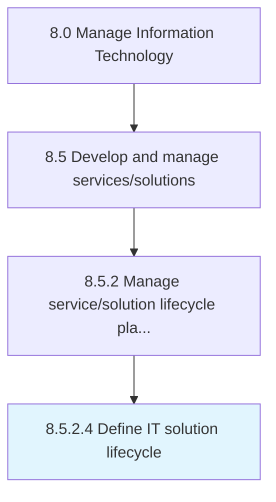

# Define IT solution lifecycle

> Defining solutions to satisfy business needs.

## Overview

Activity 8.5.2.4 is an activity within the Manage Information Technology framework. 

Defining solutions to satisfy business needs. IT solution lifecycle provides a means to address the full life cycle of an information technology solution and addresses the current and future state of IT services and solutions.

## Process Hierarchy



## Key Statistics

| Metric | Value |
|--------|-------|
| APQC Code | 20797 |
| Hierarchy ID | 8.5.2.4 |
| Level | Activity |
| Parent | [8.5.2](../) |
| Sub-Processes | 0 |


## GraphDL Semantic Structure

```
define.ITSolutionLifecycle
```

| Component | Value | Description |
|-----------|-------|-------------|
| Verb | `define` | Primary action |
| Object | `IT solution lifecycle` | Direct object |


## Related Concepts

- [ITSolutionLifecycle](/concepts/ITSolutionLifecycle)


---

*Source: APQC PCF 20797 (8.5.2.4) - APQC*
