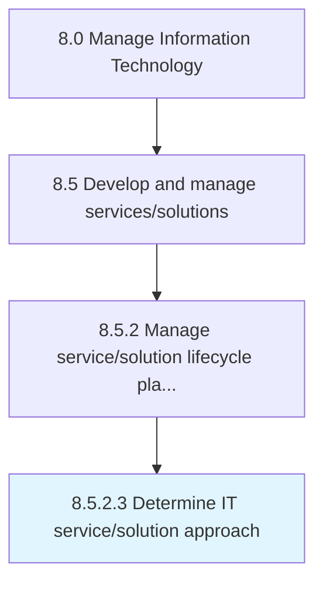

# Determine IT service/solution approach

> Determining an approach to create a base for delivering IT service/solution aligned with overall business needs while maintaining a tight control on delivery and costs.

## Overview

Activity 8.5.2.3 is an activity within the Manage Information Technology framework. 

Determining an approach to create a base for delivering IT service/solution aligned with overall business needs while maintaining a tight control on delivery and costs.

## Process Hierarchy



## Key Statistics

| Metric | Value |
|--------|-------|
| APQC Code | 20796 |
| Hierarchy ID | 8.5.2.3 |
| Level | Activity |
| Parent | [8.5.2](../) |
| Sub-Processes | 0 |


## GraphDL Semantic Structure

```
determine.ITServicesolutionApproach
```

| Component | Value | Description |
|-----------|-------|-------------|
| Verb | `determine` | Primary action |
| Object | `IT service/solution approach` | Direct object |


## Related Concepts

- ITServiceApproach
- ITSolutionApproach


---

*Source: APQC PCF 20796 (8.5.2.3) - APQC*
