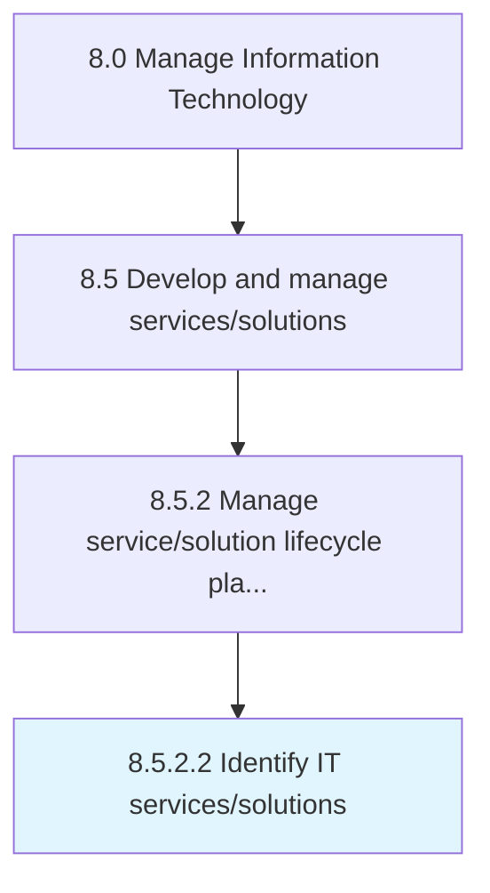

# Identify IT services/solutions

> Identifying processes and supporting procedures that are performed by an organization to design, plan, deliver, operate, and control information technology services/solutions offered to customers.

## Overview

Activity 8.5.2.2 is an activity within the Manage Information Technology framework. 

Identifying processes and supporting procedures that are performed by an organization to design, plan, deliver, operate, and control information technology services/solutions offered to customers.

## Process Hierarchy



## Key Statistics

| Metric | Value |
|--------|-------|
| APQC Code | 20795 |
| Hierarchy ID | 8.5.2.2 |
| Level | Activity |
| Parent | [8.5.2](../) |
| Sub-Processes | 0 |


## GraphDL Semantic Structure

```
identify.ITServicessolutions
```

| Component | Value | Description |
|-----------|-------|-------------|
| Verb | `identify` | Primary action |
| Object | `IT services/solutions` | Direct object |


## Related Concepts

- [ITServices](/concepts/ITServices)
- [ITSolutions](/concepts/ITSolutions)


---

*Source: APQC PCF 20795 (8.5.2.2) - APQC*
