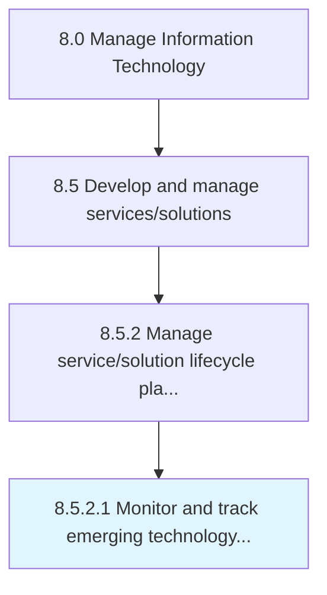

# Monitor and track emerging technology capabilities

> Perform a systematic investigation to new and future technology capabilities for future upgrades.

## Overview

Activity 8.5.2.1 is an activity within the Manage Information Technology framework. 

Perform a systematic investigation to new and future technology capabilities for future upgrades.

## Process Hierarchy



## Key Statistics

| Metric | Value |
|--------|-------|
| APQC Code | 20794 |
| Hierarchy ID | 8.5.2.1 |
| Level | Activity |
| Parent | [8.5.2](../) |
| Sub-Processes | 0 |


## GraphDL Semantic Structure

```
monitor.AndTrackEmergingTechnologyCapabilities
```

| Component | Value | Description |
|-----------|-------|-------------|
| Verb | `monitor` | Primary action |
| Object | `and track emerging technology capabilities` | Direct object |


## Related Concepts

- EmergingTechnologyCapabilities
- EmergingTechnologyCapabilities


---

*Source: APQC PCF 20794 (8.5.2.1) - APQC*
