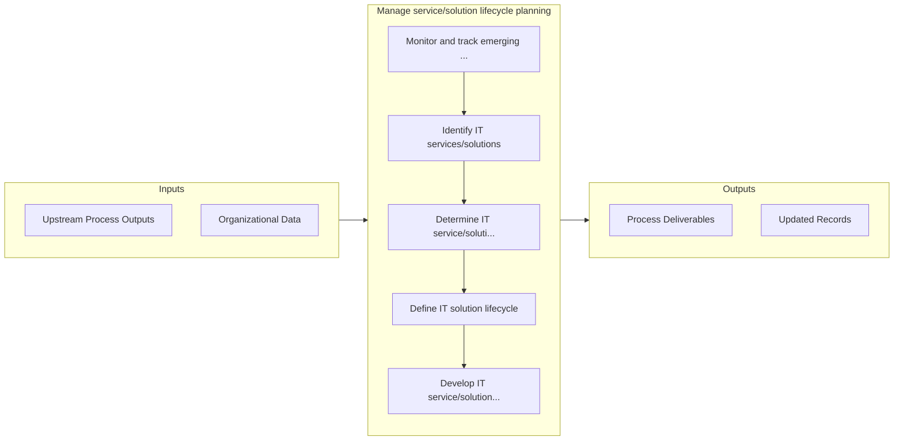

# Manage service/solution lifecycle planning

> Executing life-cycle planning for IT services and solutions.

## Overview

Process 8.5.2 is a core process that defines the specific procedures for manage service/solution lifecycle planning. 

Executing life-cycle planning for IT services and solutions. Develop new requirements and feature-function enhancements. Create and design a life cycle plan that addresses the current and future state of IT services and solutions.

## Process Hierarchy

```mermaid
graph TD
    C8["8.0 Manage Information Technology"]
    C8 --> N8_5["8.5 Develop and manage services/solutions"]
    N8_5 --> N8_5_2["8.5.2 Manage service/solution lifecycle pla..."]
    style N8_5_2 fill:#e1f5fe
    N8_5_2 --> N8_5_2_1["8.5.2.1 Monitor and track emerging techn..."]
    N8_5_2 --> N8_5_2_2["8.5.2.2 Identify IT services/solutions"]
    N8_5_2 --> N8_5_2_3["8.5.2.3 Determine IT service/solution ap..."]
    N8_5_2 --> N8_5_2_4["8.5.2.4 Define IT solution lifecycle"]
    N8_5_2 --> N8_5_2_5["8.5.2.5 Develop IT service/solution "sun..."]
```

## Key Statistics

| Metric | Value |
|--------|-------|
| APQC Code | 20793 |
| Hierarchy ID | 8.5.2 |
| Level | Process |
| Parent | [8.5](../) |
| Sub-Processes | 5 |


## GraphDL Semantic Structure

```
manage.ServicesolutionLifecyclePlanning
```

| Component | Value | Description |
|-----------|-------|-------------|
| Verb | `manage` | Primary action |
| Object | `service/solution lifecycle planning` | Direct object |


## Process Flow



## Sub-Processes

| Process | Hierarchy ID | Description |
|---------|-------------|-------------|
| [Monitor and track emerging technology capabilities](./MonitorAndTrackEmergingTechnologyCapabilities) | 8.5.2.1 | Perform a systematic investigation to new and future technology capabilities for future upgrades |
| [Identify IT services/solutions](./IdentifyITServicessolutions) | 8.5.2.2 | Identifying processes and supporting procedures that are performed by an organization to design, pla |
| [Determine IT service/solution approach](./DetermineITServicesolutionApproach) | 8.5.2.3 | Determining an approach to create a base for delivering IT service/solution aligned with overall bus |
| [Define IT solution lifecycle](./DefineITSolutionLifecycle) | 8.5.2.4 | Defining solutions to satisfy business needs |
| [Develop IT service/solution "sunset" plans](./DevelopITServicesolutionSunsetPlans) | 8.5.2.5 | Developing plans to retire IT service/solution resources when the service/solution is no longer feas |


## Related Concepts

- [ServiceLifecyclePlanning](/concepts/ServiceLifecyclePlanning)
- [SolutionLifecyclePlanning](/concepts/SolutionLifecyclePlanning)


---

*Source: APQC PCF 20793 (8.5.2) - APQC*
