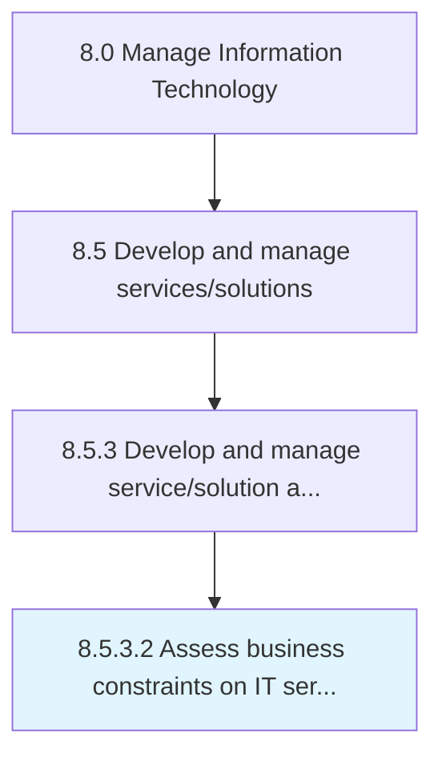

# Assess business constraints on IT service/solution

> Evaluate business limitations that may hinder IT service/solution performance.

## Overview

Activity 8.5.3.2 is an activity within the Manage Information Technology framework. 

Evaluate business limitations that may hinder IT service/solution performance.

## Process Hierarchy



## Key Statistics

| Metric | Value |
|--------|-------|
| APQC Code | 20801 |
| Hierarchy ID | 8.5.3.2 |
| Level | Activity |
| Parent | [8.5.3](../) |
| Sub-Processes | 0 |


## GraphDL Semantic Structure

```
assess.BusinessConstraints.on.ITServicesolution
```

| Component | Value | Description |
|-----------|-------|-------------|
| Verb | `assess` | Primary action |
| Object | `business constraints` | Direct object |
| Preposition | `on` | Relationship |
| PrepObject | `IT service/solution` | Indirect object |


## Related Concepts

- BusinessConstraints
- ITService
- BusinessConstraints
- ITSolution


---

*Source: APQC PCF 20801 (8.5.3.2) - APQC*
