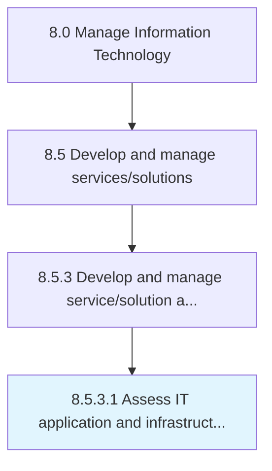

# Assess IT application and infrastructure architecture constraints

> Assessing limitations in IT application and infrastructure architecture that may hinder expected performance.

## Overview

Activity 8.5.3.1 is an activity within the Manage Information Technology framework. 

Assessing limitations in IT application and infrastructure architecture that may hinder expected performance.

## Process Hierarchy



## Key Statistics

| Metric | Value |
|--------|-------|
| APQC Code | 20800 |
| Hierarchy ID | 8.5.3.1 |
| Level | Activity |
| Parent | [8.5.3](../) |
| Sub-Processes | 0 |


## GraphDL Semantic Structure

```
assess.ITApplicationAndInfrastructureArchitectureConstraints
```

| Component | Value | Description |
|-----------|-------|-------------|
| Verb | `assess` | Primary action |
| Object | `IT application and infrastructure architecture constraints` | Direct object |


## Related Concepts

- [ITApplicationArchitectureConstraints](/concepts/ITApplicationArchitectureConstraints)
- [InfrastructureArchitectureConstraints](/concepts/InfrastructureArchitectureConstraints)


---

*Source: APQC PCF 20800 (8.5.3.1) - APQC*
