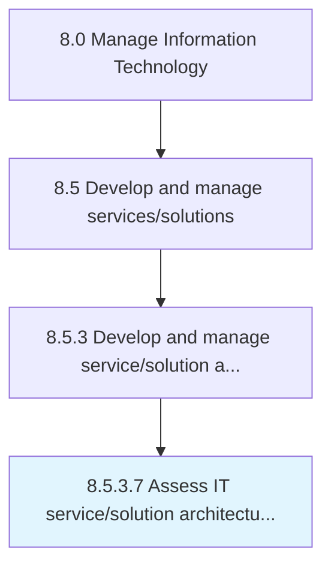

# Assess IT service/solution architecture conformance

> Assessing functional compliance of the IT service/solution architecture.

## Overview

Activity 8.5.3.7 is an activity within the Manage Information Technology framework. 

Assessing functional compliance of the IT service/solution architecture. Safeguard compliance with guidelines for the architecture.

## Process Hierarchy



## Key Statistics

| Metric | Value |
|--------|-------|
| APQC Code | 20806 |
| Hierarchy ID | 8.5.3.7 |
| Level | Activity |
| Parent | [8.5.3](../) |
| Sub-Processes | 0 |


## GraphDL Semantic Structure

```
assess.ITServicesolutionArchitectureConformance
```

| Component | Value | Description |
|-----------|-------|-------------|
| Verb | `assess` | Primary action |
| Object | `IT service/solution architecture conformance` | Direct object |


## Related Concepts

- [ITServiceArchitectureConformance](/concepts/ITServiceArchitectureConformance)
- [ITSolutionArchitectureConformance](/concepts/ITSolutionArchitectureConformance)


---

*Source: APQC PCF 20806 (8.5.3.7) - APQC*
