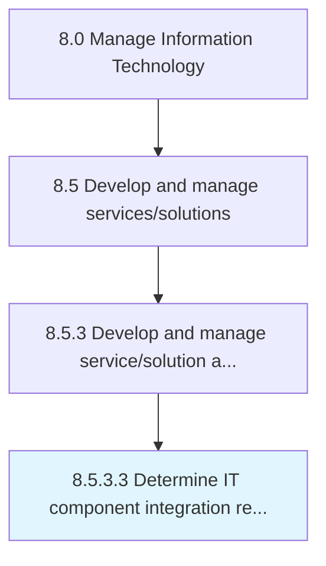

# Determine IT component integration requirements

> Determining the requirements to integrate IT components such as hardware, software, database, telecommunication, and network.

## Overview

Activity 8.5.3.3 is an activity within the Manage Information Technology framework. 

Determining the requirements to integrate IT components such as hardware, software, database, telecommunication, and network.

## Process Hierarchy



## Key Statistics

| Metric | Value |
|--------|-------|
| APQC Code | 20802 |
| Hierarchy ID | 8.5.3.3 |
| Level | Activity |
| Parent | [8.5.3](../) |
| Sub-Processes | 0 |


## GraphDL Semantic Structure

```
determine.ITComponentIntegrationRequirements
```

| Component | Value | Description |
|-----------|-------|-------------|
| Verb | `determine` | Primary action |
| Object | `IT component integration requirements` | Direct object |


## Related Concepts

- [ITComponentIntegrationRequirements](/concepts/ITComponentIntegrationRequirements)


---

*Source: APQC PCF 20802 (8.5.3.3) - APQC*
