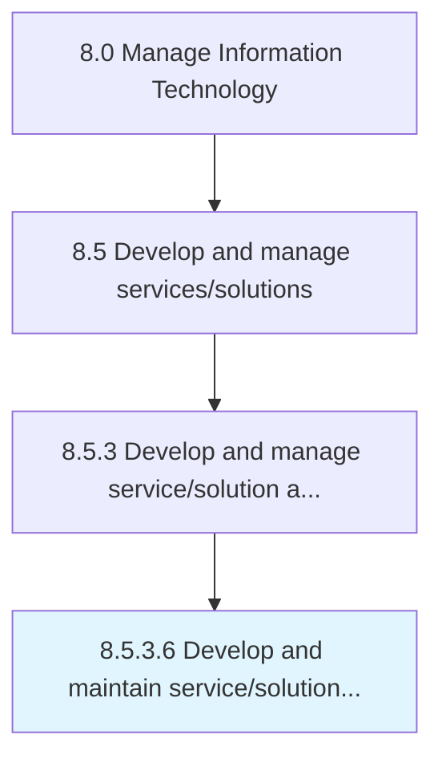

# Develop and maintain service/solution architectures

> Creating and maintaining a services and solutions architecture over a network that can be revised as needed or even eliminated in case of inefficiencies.

## Overview

Activity 8.5.3.6 is an activity within the Manage Information Technology framework. 

Creating and maintaining a services and solutions architecture over a network that can be revised as needed or even eliminated in case of inefficiencies.

## Process Hierarchy



## Key Statistics

| Metric | Value |
|--------|-------|
| APQC Code | 20805 |
| Hierarchy ID | 8.5.3.6 |
| Level | Activity |
| Parent | [8.5.3](../) |
| Sub-Processes | 0 |


## GraphDL Semantic Structure

```
develop.AndMaintainServicesolutionArchitectures
```

| Component | Value | Description |
|-----------|-------|-------------|
| Verb | `develop` | Primary action |
| Object | `and maintain service/solution architectures` | Direct object |


## Related Concepts

- ServiceArchitectures
- SolutionArchitectures
- ServiceArchitectures
- SolutionArchitectures


---

*Source: APQC PCF 20805 (8.5.3.6) - APQC*
