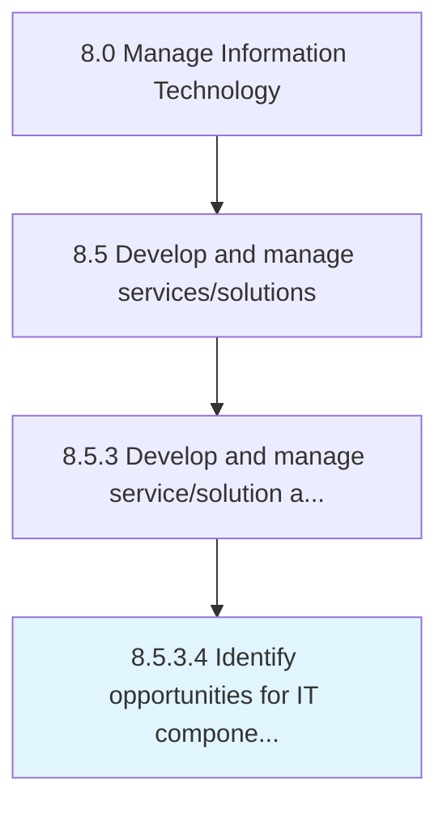

# Identify opportunities for IT component reuse

> Identification of opportunities for reusing IT components so that they can be cost-effective and efficient.

## Overview

Activity 8.5.3.4 is an activity within the Manage Information Technology framework. 

Identification of opportunities for reusing IT components so that they can be cost-effective and efficient.

## Process Hierarchy



## Key Statistics

| Metric | Value |
|--------|-------|
| APQC Code | 20803 |
| Hierarchy ID | 8.5.3.4 |
| Level | Activity |
| Parent | [8.5.3](../) |
| Sub-Processes | 0 |


## GraphDL Semantic Structure

```
identify.Opportunities.for.ITComponentReuse
```

| Component | Value | Description |
|-----------|-------|-------------|
| Verb | `identify` | Primary action |
| Object | `opportunities` | Direct object |
| Preposition | `for` | Relationship |
| PrepObject | `IT component reuse` | Indirect object |


## Related Concepts

- Opportunities
- ITComponentReuse


---

*Source: APQC PCF 20803 (8.5.3.4) - APQC*
