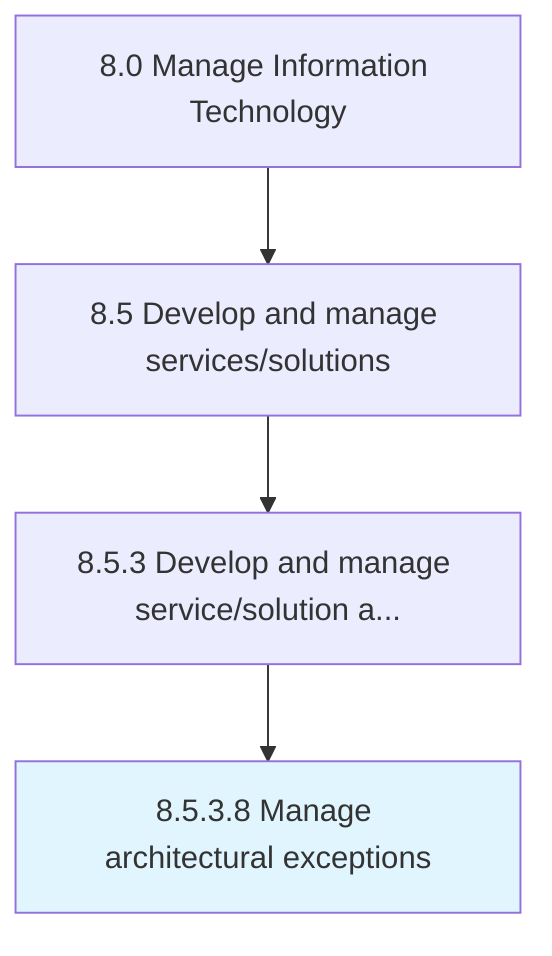

# Manage architectural exceptions

> Identifying and resolving any architectural exceptions.

## Overview

Activity 8.5.3.8 is an activity within the Manage Information Technology framework. 

Identifying and resolving any architectural exceptions. Address the internal inquiries related to architecture that cannot be addressed immediately. Research inquiries that require the need of exceptional methods.

## Process Hierarchy



## Key Statistics

| Metric | Value |
|--------|-------|
| APQC Code | 20807 |
| Hierarchy ID | 8.5.3.8 |
| Level | Activity |
| Parent | [8.5.3](../) |
| Sub-Processes | 0 |


## GraphDL Semantic Structure

```
manage.ArchitecturalExceptions
```

| Component | Value | Description |
|-----------|-------|-------------|
| Verb | `manage` | Primary action |
| Object | `architectural exceptions` | Direct object |


## Related Concepts

- [ArchitecturalExceptions](/concepts/ArchitecturalExceptions)


---

*Source: APQC PCF 20807 (8.5.3.8) - APQC*
