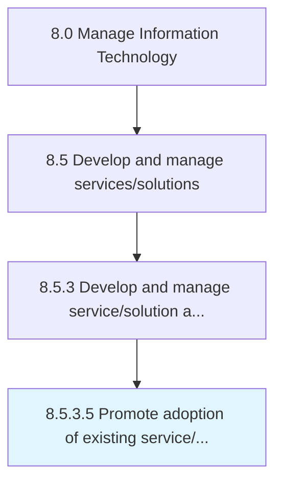

# Promote adoption of existing service/solution architecture

> Encouraging acceptance of existing IT service/solution architecture in the organization.

## Overview

Activity 8.5.3.5 is an activity within the Manage Information Technology framework. 

Encouraging acceptance of existing IT service/solution architecture in the organization.

## Process Hierarchy



## Key Statistics

| Metric | Value |
|--------|-------|
| APQC Code | 20804 |
| Hierarchy ID | 8.5.3.5 |
| Level | Activity |
| Parent | [8.5.3](../) |
| Sub-Processes | 0 |


## GraphDL Semantic Structure

```
promote.Adoption.of.ExistingServicesolutionArchitecture
```

| Component | Value | Description |
|-----------|-------|-------------|
| Verb | `promote` | Primary action |
| Object | `adoption` | Direct object |
| Preposition | `of` | Relationship |
| PrepObject | `existing service/solution architecture` | Indirect object |


## Related Concepts

- Adoption
- ExistingServiceArchitecture
- Adoption
- ExistingSolutionArchitecture


---

*Source: APQC PCF 20804 (8.5.3.5) - APQC*
