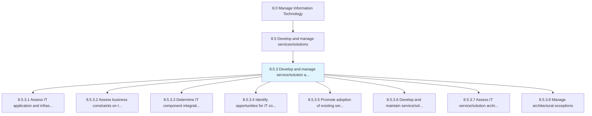
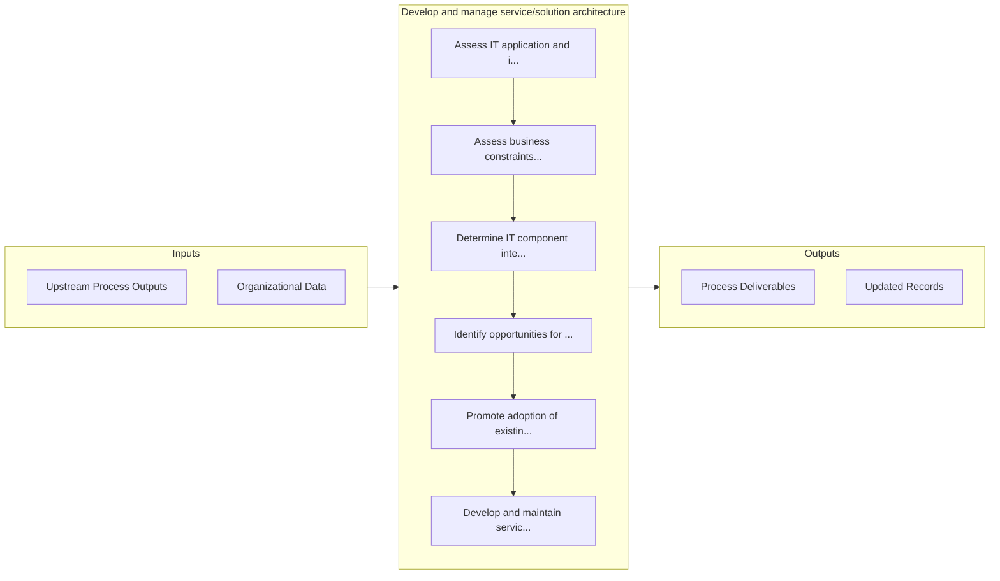

# Develop and manage service/solution architecture

> Creating the architecture for the IT services and solutions.

## Overview

Process 8.5.3 is a core process that defines the specific procedures for develop and manage service/solution architecture. 

Creating the architecture for the IT services and solutions. Assess architecture and business constraints in order to understand integration requirements. Promote existing architecture. Manage exceptions.

## Process Hierarchy



## Key Statistics

| Metric | Value |
|--------|-------|
| APQC Code | 20799 |
| Hierarchy ID | 8.5.3 |
| Level | Process |
| Parent | [8.5](../) |
| Sub-Processes | 8 |


## GraphDL Semantic Structure

```graphdl
develop.AndManageServicesolutionArchitecture
```

| Component | Value | Description |
|-----------|-------|-------------|
| Verb | `develop` | Primary action |
| Object | `and manage service/solution architecture` | Direct object |


## Process Flow



## Sub-Processes

| Process | Hierarchy ID | Description |
|---------|-------------|-------------|
| [Assess IT application and infrastructure architecture constraints](./AssessITApplicationAndInfrastructureArchitectureConstraints) | 8.5.3.1 | Assessing limitations in IT application and infrastructure architecture that may hinder expected per |
| [Assess business constraints on IT service/solution](./AssessBusinessConstraintsOnITServicesolution) | 8.5.3.2 | Evaluate business limitations that may hinder IT service/solution performance |
| [Determine IT component integration requirements](./DetermineITComponentIntegrationRequirements) | 8.5.3.3 | Determining the requirements to integrate IT components such as hardware, software, database, teleco |
| [Identify opportunities for IT component reuse](./IdentifyOpportunitiesForITComponentReuse) | 8.5.3.4 | Identification of opportunities for reusing IT components so that they can be cost-effective and eff |
| [Promote adoption of existing service/solution architecture](./PromoteAdoptionOfExistingServicesolutionArchitecture) | 8.5.3.5 | Encouraging acceptance of existing IT service/solution architecture in the organization |
| [Develop and maintain service/solution architectures](./DevelopAndMaintainServicesolutionArchitectures) | 8.5.3.6 | Creating and maintaining a services and solutions architecture over a network that can be revised as |
| [Assess IT service/solution architecture conformance](./AssessITServicesolutionArchitectureConformance) | 8.5.3.7 | Assessing functional compliance of the IT service/solution architecture |
| [Manage architectural exceptions](./ManageArchitecturalExceptions) | 8.5.3.8 | Identifying and resolving any architectural exceptions |


## Related Concepts

- ServiceArchitecture
- SolutionArchitecture
- ServiceArchitecture
- SolutionArchitecture


---

*Source: APQC PCF 20799 (8.5.3) - APQC*
