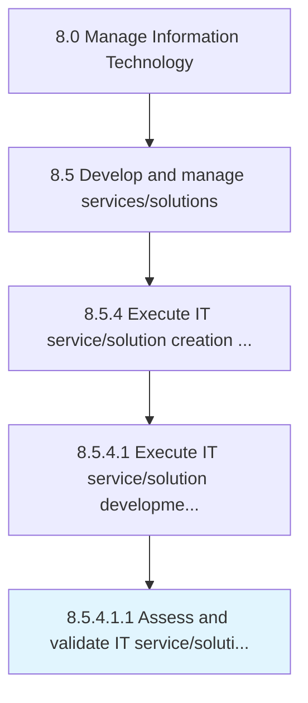

# Assess and validate IT service/solution requirements

> Evaluating and validating the requirements and needs of IT service/solution.

## Overview

Sub-Activity 8.5.4.1.1 is an activity within the Manage Information Technology framework. 

Evaluating and validating the requirements and needs of IT service/solution.

## Process Hierarchy



## Key Statistics

| Metric | Value |
|--------|-------|
| APQC Code | 20810 |
| Hierarchy ID | 8.5.4.1.1 |
| Level | Sub-Activity |
| Parent | [8.5.4.1](../) |
| Sub-Processes | 0 |


## GraphDL Semantic Structure

```
assess.AndValidateITServicesolutionRequirements
```

| Component | Value | Description |
|-----------|-------|-------------|
| Verb | `assess` | Primary action |
| Object | `and validate IT service/solution requirements` | Direct object |


## Related Concepts

- ITServiceRequirements
- ITSolutionRequirements
- ITServiceRequirements
- ITSolutionRequirements


---

*Source: APQC PCF 20810 (8.5.4.1.1) - APQC*
