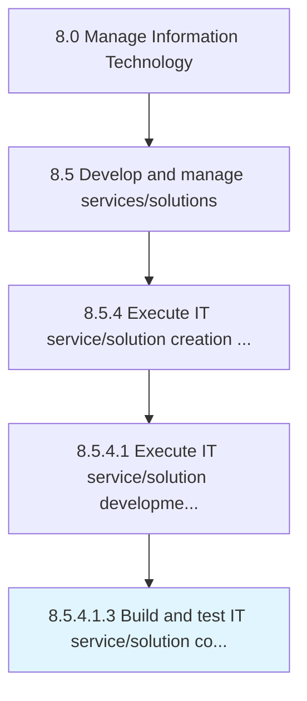

# Build and test IT service/solution components

> Building and testing new components required for the development of IT services and solutions.

## Overview

Sub-Activity 8.5.4.1.3 is an activity within the Manage Information Technology framework. 

Building and testing new components required for the development of IT services and solutions.

## Process Hierarchy



## Key Statistics

| Metric | Value |
|--------|-------|
| APQC Code | 20812 |
| Hierarchy ID | 8.5.4.1.3 |
| Level | Sub-Activity |
| Parent | [8.5.4.1](../) |
| Sub-Processes | 0 |


## GraphDL Semantic Structure

```
build.AndTestITServicesolutionComponents
```

| Component | Value | Description |
|-----------|-------|-------------|
| Verb | `build` | Primary action |
| Object | `and test IT service/solution components` | Direct object |


## Related Concepts

- ITServiceComponents
- ITSolutionComponents
- ITServiceComponents
- ITSolutionComponents


---

*Source: APQC PCF 20812 (8.5.4.1.3) - APQC*
