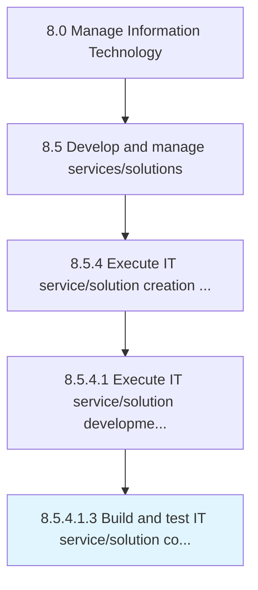
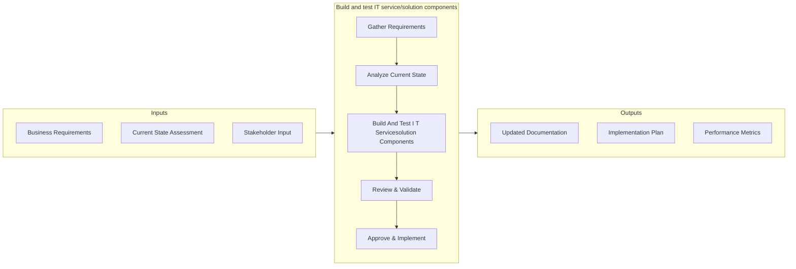

# Build and test IT service/solution components

> Building and testing new components required for the development of IT services and solutions.

## Overview

SubActivity 8.5.4.1.3 focuses on the process of build and test it service/solution components within the Manage Information Technology framework. This activity is critical for ensuring that IT operations align with organizational objectives and deliver measurable value. Building and testing new components required for the development of IT services and solutions. The process involves systematic planning, execution, and monitoring to ensure consistent quality outcomes. Effective implementation requires cross-functional collaboration between IT teams and business stakeholders, with clear governance structures and defined success criteria. Organizations that excel at this process typically demonstrate stronger IT-business alignment, reduced operational risks, and improved service delivery performance.

## Process Hierarchy



## Key Statistics

| Metric | Value |
|--------|-------|
| APQC Code | 20812 |
| Hierarchy ID | 8.5.4.1.3 |
| Level | SubActivity |
| Parent | [8.5.4.1](../) |
| Sub-Processes | 0 |

## Process Flow



## GraphDL Semantic Structure

```
build.AndTestITServicesolutionComponents
```

| Component | Value | Description |
|-----------|-------|-------------|
| Verb | `build` | Primary action |
| Object | `and test IT service/solution components` | Direct object |

## Related Concepts

- ITServiceComponents
- ITSolutionComponents
- ITServiceComponents
- ITSolutionComponents

## RACI Matrix

| Activity | Responsible | Accountable | Consulted | Informed |
|----------|-------------|-------------|-----------|----------|
| Build and test IT service/solution components | IT Financial Analyst | CIO / CFO | Procurement | Budget Owners |
| Review & Approve | IT Director | CIO | Compliance Officer | Executive Team |
| Document & Report | IT Analyst | IT Manager | Quality Assurance | Stakeholders |

## Related Occupations

- [IT Financial Analyst](/occupations/FinancialAnalysts) - Manages IT budgets and cost analysis
- [IT Procurement Specialist](/occupations/PurchasingManagers) - Handles IT vendor contracts and procurement
- [Chief Information Officer (CIO)](/occupations/ChiefInformationOfficers) - Approves IT financial plans
- [IT Asset Manager](/occupations/AdministrativeServicesManagers) - Tracks IT asset lifecycle costs

## Related Departments

- [IT Finance](/departments/ITFinance) - Manages IT budgets and investments
- [Procurement](/departments/Procurement) - Handles vendor management
- [Accounting](/departments/Accounting) - Tracks IT expenditures

## Industry Variations

### Financial Services

In banking and insurance, this process emphasizes regulatory compliance, data privacy requirements, and integration with legacy core systems. Activities include SOX compliance checks, PCI-DSS adherence, and alignment with financial regulatory frameworks.

**Industry-Specific Considerations:**
- Regulatory audit trail requirements
- Data encryption and privacy mandates
- Integration with core banking/insurance platforms

### Healthcare

Healthcare organizations adapt this process to meet HIPAA requirements, electronic health record (EHR) system demands, and clinical workflow integration. Patient data security and interoperability standards (HL7/FHIR) are central concerns.

**Industry-Specific Considerations:**
- HIPAA compliance and patient data protection
- EHR system integration requirements
- Clinical workflow optimization

### Technology / Software

Technology companies typically execute this process with agile methodologies, continuous delivery pipelines, and cloud-native architectures. Emphasis is on rapid iteration, DevOps practices, and scalable infrastructure.

**Industry-Specific Considerations:**
- Agile and DevOps integration
- Cloud-first architecture patterns
- Continuous integration/continuous deployment (CI/CD)

## KPIs & Metrics

| Metric | Description | Target |
|--------|-------------|--------|
| Process Cycle Time | Average time to complete the build process end-to-end | < 5 business days |
| Stakeholder Satisfaction | Satisfaction score from internal stakeholders | > 4.0 / 5.0 |
| Compliance Rate | Percentage of activities meeting policy requirements | > 95% |
| Cost Efficiency | Cost per process execution relative to budget | Within 10% of budget |
| First-Time Quality Rate | Percentage of deliverables accepted without rework | > 90% |

---

*Source: APQC PCF 20812 (8.5.4.1.3) - APQC*
