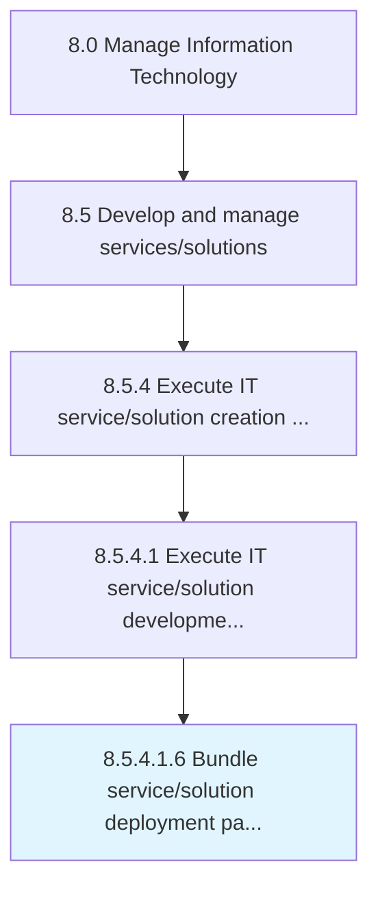

# Bundle service/solution deployment packaging

> Creating and implementing a strategy for the deployment of IT service/solution by defining all of the activities that make the IT function available for use.

## Overview

Sub-Activity 8.5.4.1.6 is an activity within the Manage Information Technology framework. 

Creating and implementing a strategy for the deployment of IT service/solution by defining all of the activities that make the IT function available for use. Define the deployment process, procedures, and tools. Select the most feasible and practical methodologies for the deployment process.

## Process Hierarchy



## Key Statistics

| Metric | Value |
|--------|-------|
| APQC Code | 20815 |
| Hierarchy ID | 8.5.4.1.6 |
| Level | Sub-Activity |
| Parent | [8.5.4.1](../) |
| Sub-Processes | 0 |


## GraphDL Semantic Structure

```
bundle.ServicesolutionDeploymentPackaging
```

| Component | Value | Description |
|-----------|-------|-------------|
| Verb | `bundle` | Primary action |
| Object | `service/solution deployment packaging` | Direct object |


## Related Concepts

- ServiceDeploymentPackaging
- SolutionDeploymentPackaging


---

*Source: APQC PCF 20815 (8.5.4.1.6) - APQC*
