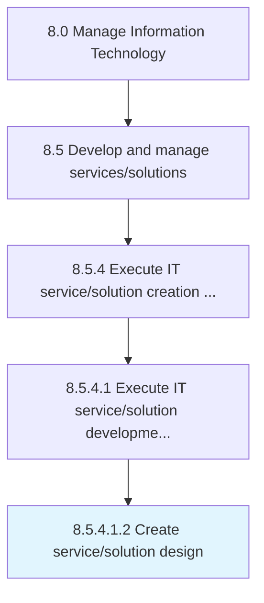

# Create service/solution design

> Formulating a design for service/solution that helps an organization to meet its objectives.

## Overview

Sub-Activity 8.5.4.1.2 is an activity within the Manage Information Technology framework. 

Formulating a design for service/solution that helps an organization to meet its objectives. Develop a new framework for molding the service/solution processes into a coherent and structured form.

## Process Hierarchy



## Key Statistics

| Metric | Value |
|--------|-------|
| APQC Code | 20811 |
| Hierarchy ID | 8.5.4.1.2 |
| Level | Sub-Activity |
| Parent | [8.5.4.1](../) |
| Sub-Processes | 0 |


## GraphDL Semantic Structure

```
create.ServicesolutionDesign
```

| Component | Value | Description |
|-----------|-------|-------------|
| Verb | `create` | Primary action |
| Object | `service/solution design` | Direct object |


## Related Concepts

- ServiceDesign
- SolutionDesign


---

*Source: APQC PCF 20811 (8.5.4.1.2) - APQC*
