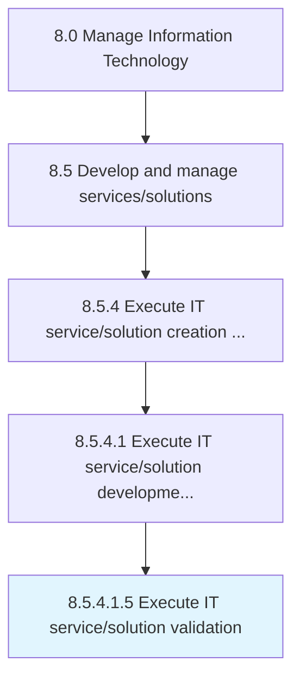

# Execute IT service/solution validation

> Validating that the proposed IT service/solution is feasible and provides the needed services for the customer.

## Overview

Sub-Activity 8.5.4.1.5 is an activity within the Manage Information Technology framework. 

Validating that the proposed IT service/solution is feasible and provides the needed services for the customer.

## Process Hierarchy



## Key Statistics

| Metric | Value |
|--------|-------|
| APQC Code | 20814 |
| Hierarchy ID | 8.5.4.1.5 |
| Level | Sub-Activity |
| Parent | [8.5.4.1](../) |
| Sub-Processes | 0 |


## GraphDL Semantic Structure

```
execute.ITServicesolutionValidation
```

| Component | Value | Description |
|-----------|-------|-------------|
| Verb | `execute` | Primary action |
| Object | `IT service/solution validation` | Direct object |


## Related Concepts

- ITServiceValidation
- ITSolutionValidation


---

*Source: APQC PCF 20814 (8.5.4.1.5) - APQC*
