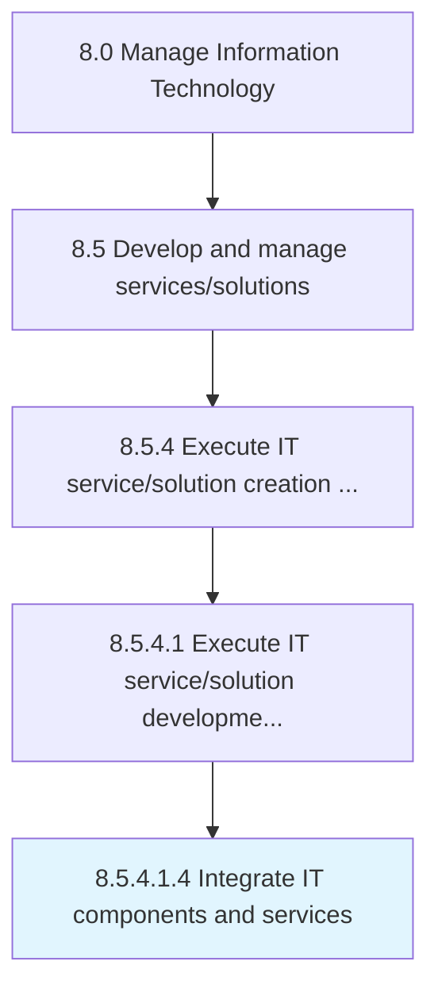

# Integrate IT components and services

> Combining the newly built IT component along with IT services in order to gain optimum output.

## Overview

Sub-Activity 8.5.4.1.4 is an activity within the Manage Information Technology framework. 

Combining the newly built IT component along with IT services in order to gain optimum output.

## Process Hierarchy



## Key Statistics

| Metric | Value |
|--------|-------|
| APQC Code | 20813 |
| Hierarchy ID | 8.5.4.1.4 |
| Level | Sub-Activity |
| Parent | [8.5.4.1](../) |
| Sub-Processes | 0 |


## GraphDL Semantic Structure

```
integrate.ITComponentsAndServices
```

| Component | Value | Description |
|-----------|-------|-------------|
| Verb | `integrate` | Primary action |
| Object | `IT components and services` | Direct object |


## Related Concepts

- [ITComponents](/concepts/ITComponents)
- [Services](/concepts/Services)


---

*Source: APQC PCF 20813 (8.5.4.1.4) - APQC*
