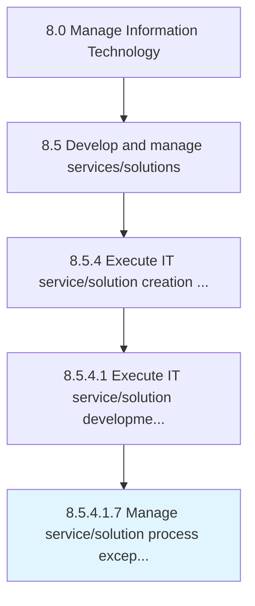

# Manage service/solution process exceptions

> Identifying and resolving internal needs/inquiries for service/solution that cannot be resolved immediately.

## Overview

Sub-Activity 8.5.4.1.7 is an activity within the Manage Information Technology framework. 

Identifying and resolving internal needs/inquiries for service/solution that cannot be resolved immediately. Research inquiries that require the need of exceptional solutions.

## Process Hierarchy



## Key Statistics

| Metric | Value |
|--------|-------|
| APQC Code | 20816 |
| Hierarchy ID | 8.5.4.1.7 |
| Level | Sub-Activity |
| Parent | [8.5.4.1](../) |
| Sub-Processes | 0 |


## GraphDL Semantic Structure

```
manage.ServicesolutionProcessExceptions
```

| Component | Value | Description |
|-----------|-------|-------------|
| Verb | `manage` | Primary action |
| Object | `service/solution process exceptions` | Direct object |


## Related Concepts

- ServiceProcessExceptions
- SolutionProcessExceptions


---

*Source: APQC PCF 20816 (8.5.4.1.7) - APQC*
