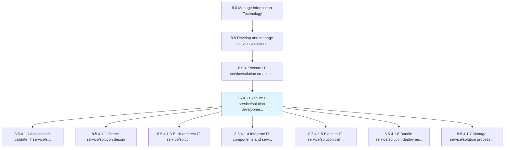
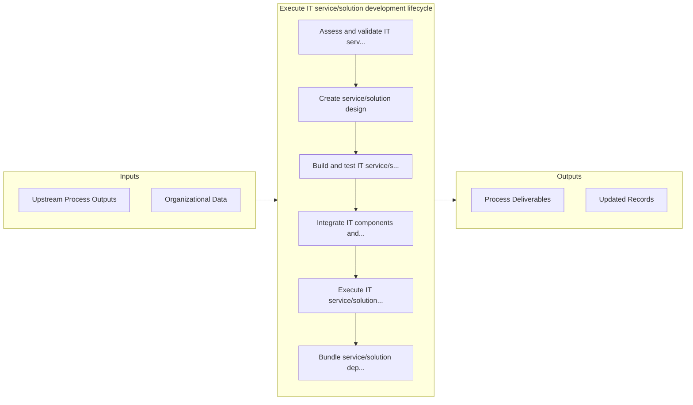

# Execute IT service/solution development lifecycle

> Executing an information system, aiming to produce a high quality system that meets or exceeds customer expectations, reaches completion within time and cost estimates, and is inexpensive to maintain and cost-effective to enhance.

## Overview

Activity 8.5.4.1 is an activity within the Manage Information Technology framework. 

Executing an information system, aiming to produce a high quality system that meets or exceeds customer expectations, reaches completion within time and cost estimates, and is inexpensive to maintain and cost-effective to enhance.

## Process Hierarchy



## Key Statistics

| Metric | Value |
|--------|-------|
| APQC Code | 20809 |
| Hierarchy ID | 8.5.4.1 |
| Level | Activity |
| Parent | [8.5.4](../) |
| Sub-Processes | 7 |


## GraphDL Semantic Structure

```graphdl
execute.ITServicesolutionDevelopmentLifecycle
```

| Component | Value | Description |
|-----------|-------|-------------|
| Verb | `execute` | Primary action |
| Object | `IT service/solution development lifecycle` | Direct object |


## Process Flow



## Sub-Processes

| Process | Hierarchy ID | Description |
|---------|-------------|-------------|
| [Assess and validate IT service/solution requirements](./AssessAndValidateITServicesolutionRequirements) | 8.5.4.1.1 | Evaluating and validating the requirements and needs of IT service/solution |
| [Create service/solution design](./CreateServicesolutionDesign) | 8.5.4.1.2 | Formulating a design for service/solution that helps an organization to meet its objectives |
| [Build and test IT service/solution components](./BuildAndTestITServicesolutionComponents) | 8.5.4.1.3 | Building and testing new components required for the development of IT services and solutions |
| [Integrate IT components and services](./IntegrateITComponentsAndServices) | 8.5.4.1.4 | Combining the newly built IT component along with IT services in order to gain optimum output |
| [Execute IT service/solution validation](./ExecuteITServicesolutionValidation) | 8.5.4.1.5 | Validating that the proposed IT service/solution is feasible and provides the needed services for th |
| [Bundle service/solution deployment packaging](./BundleServicesolutionDeploymentPackaging) | 8.5.4.1.6 | Creating and implementing a strategy for the deployment of IT service/solution by defining all of th |
| [Manage service/solution process exceptions](./ManageServicesolutionProcessExceptions) | 8.5.4.1.7 | Identifying and resolving internal needs/inquiries for service/solution that cannot be resolved imme |


## Related Concepts

- ITServiceDevelopmentLifecycle
- ITSolutionDevelopmentLifecycle


---

*Source: APQC PCF 20809 (8.5.4.1) - APQC*
