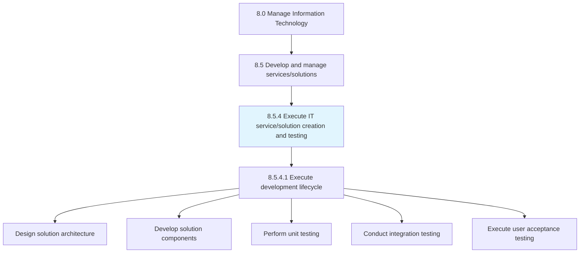
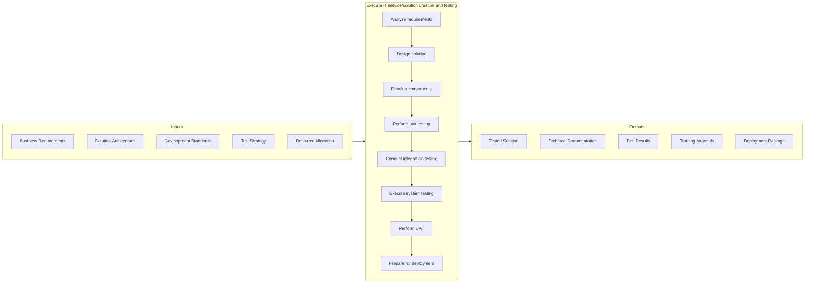
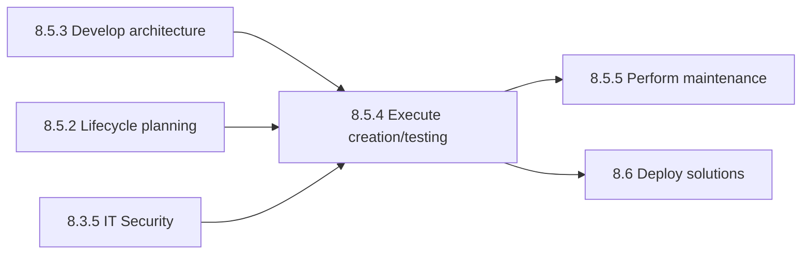

# Execute IT service/solution creation and testing

> Understanding customer requirements.

## Overview

Process 8.5.4 is a core process that defines the specific procedures for execute IT service/solution creation and testing. This process encompasses the full development lifecycle from requirements through deployment-ready solutions.

Understanding customer requirements. Design the IT services and solutions based on the requirements. Develop components for providing the requirements. Train resources to provide support. Test the IT services and solutions in advance. Confirm the customer experience post-sale.

This process is fundamental to IT value delivery, transforming business requirements into functional IT services and solutions. It applies software development lifecycle (SDLC) methodologies, quality assurance practices, and modern development approaches including Agile, DevOps, and continuous integration/continuous deployment (CI/CD) practices.

## Process Hierarchy



## Key Statistics

| Metric | Value |
|--------|-------|
| APQC Code | 20808 |
| Hierarchy ID | 8.5.4 |
| Level | Process |
| Parent | [8.5](../) |
| Sub-Processes | 1 |
| Industry Variants | 19 |

## GraphDL Semantic Structure

```graphdl
execute.ITServiceCreation
execute.ITSolutionTesting
```

| Component | Value | Description |
|-----------|-------|-------------|
| Verb | `execute` | Primary action of carrying out development activities |
| Object | `IT service/solution creation and testing` | Development and QA activities |

## Process Flow



## Child Process Listings

### 8.5.4.1 - Execute IT service/solution development lifecycle

Executing an information system, aiming to produce a high-quality system that meets or exceeds customer expectations, reaches completion within time and cost estimates, and operates effectively within the organizational infrastructure.

**Key Activities:**
- Design solution architecture and components
- Develop application code and configurations
- Create and execute unit tests
- Perform integration testing
- Conduct system testing
- Execute performance testing
- Support user acceptance testing
- Prepare deployment documentation

[View Process Details](./8.5.4.1-ExecuteITServicesolutionDevelopment/)

## RACI Matrix

| Activity | Development Lead | QA Manager | Solution Architect | Project Manager | Business Analyst | IT Manager |
|----------|-----------------|------------|-------------------|-----------------|------------------|------------|
| Analyze requirements | C | I | A | C | R | I |
| Design solution | R | C | A | C | C | I |
| Develop components | R | I | C | C | I | I |
| Perform unit testing | R | C | I | I | I | I |
| Conduct integration testing | C | R | C | C | I | I |
| Execute system testing | C | R | C | C | I | I |
| Perform UAT | C | C | I | R | R | A |
| Prepare deployment | R | C | C | A | I | C |
| Document solution | R | C | A | C | C | I |

**Legend:** R = Responsible, A = Accountable, C = Consulted, I = Informed

## Metrics and KPIs

| Metric | Description | Target | Frequency |
|--------|-------------|--------|-----------|
| Development Velocity | Story points or features completed per sprint | Trend up | Sprint |
| Code Quality Score | Static analysis quality metrics | >85% | Per build |
| Unit Test Coverage | Percentage of code covered by unit tests | >80% | Per build |
| Defect Density | Defects per thousand lines of code | <5 | Per release |
| Test Pass Rate | Percentage of test cases passing | >95% | Per test cycle |
| UAT Acceptance Rate | Percentage of features accepted first time | >90% | Per release |
| Development Cycle Time | Time from requirements to deployment-ready | Benchmark | Per release |
| Rework Rate | Percentage of work requiring rework | <15% | Per sprint |
| Technical Debt Ratio | Ratio of remediation cost to development cost | <10% | Quarterly |
| Environment Availability | Development/test environment uptime | >99% | Weekly |

## Related Departments

- [Software Development](/departments/IT/Development) - Application development execution
- [Quality Assurance](/departments/IT/QA) - Testing and quality management
- [Solution Architecture](/departments/IT/Architecture) - Technical design oversight
- [Business Analysis](/departments/IT/BusinessAnalysis) - Requirements management
- [DevOps Engineering](/departments/IT/DevOps) - CI/CD and automation
- [Project Management Office](/departments/PMO) - Project delivery coordination

## Related Occupations

- [Software Developers](/occupations/Technology/Development/SoftwareDevelopers) - Solution development
- [Software Quality Assurance Analysts](/occupations/Technology/Quality/SoftwareQAAnalysts) - Testing execution
- [Computer Systems Analysts](/occupations/Technology/Analysis/ComputerSystemsAnalysts) - Requirements analysis
- [Database Administrators](/occupations/Technology/Database/DatabaseAdministrators) - Data layer development
- [Computer Network Architects](/occupations/Technology/Architecture/NetworkArchitects) - Infrastructure design
- [Web Developers](/occupations/Technology/Development/WebDevelopers) - Web solution development

## Related Concepts

- ITServiceCreation
- ITSolutionCreation
- Testing
- SoftwareDevelopmentLifecycle
- QualityAssurance
- ContinuousIntegration

## Related Processes



---

*Source: APQC PCF 20808 (8.5.4) - APQC*
