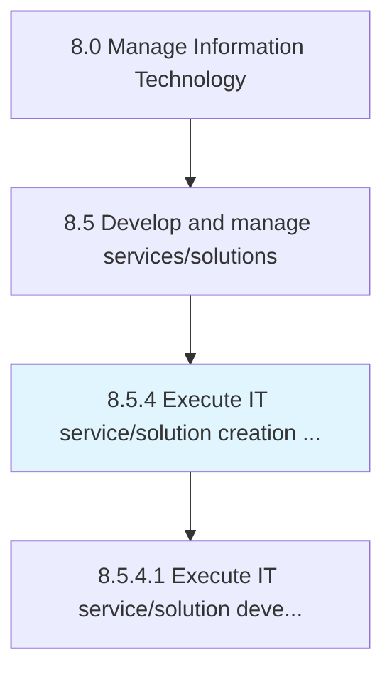
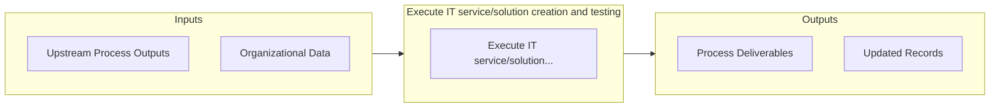

# Execute IT service/solution creation and testing

> Understanding customer requirements.

## Overview

Process 8.5.4 is a core process that defines the specific procedures for execute it service/solution creation and testing. 

Understanding customer requirements. Design the IT services and solutions based on the requirements. Develop components for providing the requirements. Train resources to provide support. Test the IT services and solutions in advance. Confirm the customer experience post-sale.

## Process Hierarchy



## Key Statistics

| Metric | Value |
|--------|-------|
| APQC Code | 20808 |
| Hierarchy ID | 8.5.4 |
| Level | Process |
| Parent | [8.5](../) |
| Sub-Processes | 1 |


## GraphDL Semantic Structure

```
execute.ITServicesolutionCreationAndTesting
```

| Component | Value | Description |
|-----------|-------|-------------|
| Verb | `execute` | Primary action |
| Object | `IT service/solution creation and testing` | Direct object |


## Process Flow



## Sub-Processes

| Process | Hierarchy ID | Description |
|---------|-------------|-------------|
| [Execute IT service/solution development lifecycle](./8.5.4.1-ExecuteITServicesolutionDevelopment/) | 8.5.4.1 | Executing an information system, aiming to produce a high quality system that meets or exceeds custo |


## Related Concepts

- ITServiceCreation
- ITSolutionCreation
- Testing


---

*Source: APQC PCF 20808 (8.5.4) - APQC*
