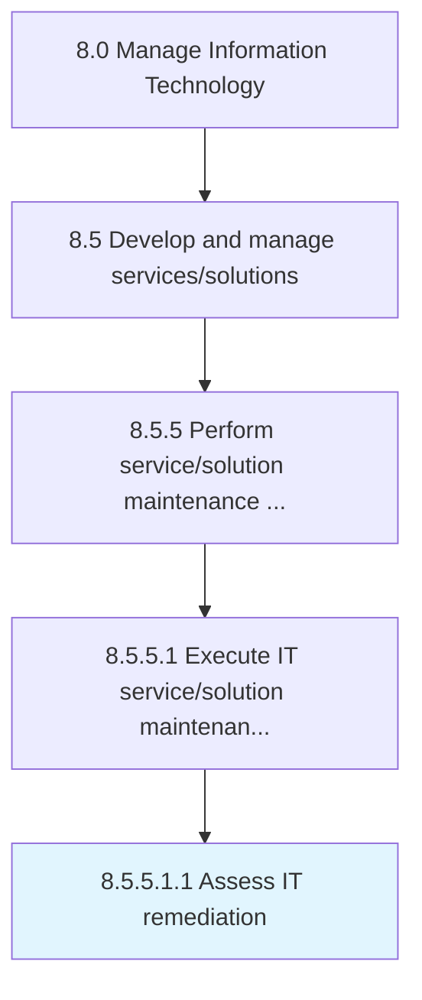

# Assess IT remediation

> Evaluate plans to address information technology environmental adulteration for rectification efforts.

## Overview

Sub-Activity 8.5.5.1.1 is an activity within the Manage Information Technology framework. 

Evaluate plans to address information technology environmental adulteration for rectification efforts.

## Process Hierarchy



## Key Statistics

| Metric | Value |
|--------|-------|
| APQC Code | 20819 |
| Hierarchy ID | 8.5.5.1.1 |
| Level | Sub-Activity |
| Parent | [8.5.5.1](../) |
| Sub-Processes | 0 |


## GraphDL Semantic Structure

```
assess.ITRemediation
```

| Component | Value | Description |
|-----------|-------|-------------|
| Verb | `assess` | Primary action |
| Object | `IT remediation` | Direct object |


## Related Concepts

- [ITRemediation](/concepts/ITRemediation)


---

*Source: APQC PCF 20819 (8.5.5.1.1) - APQC*
