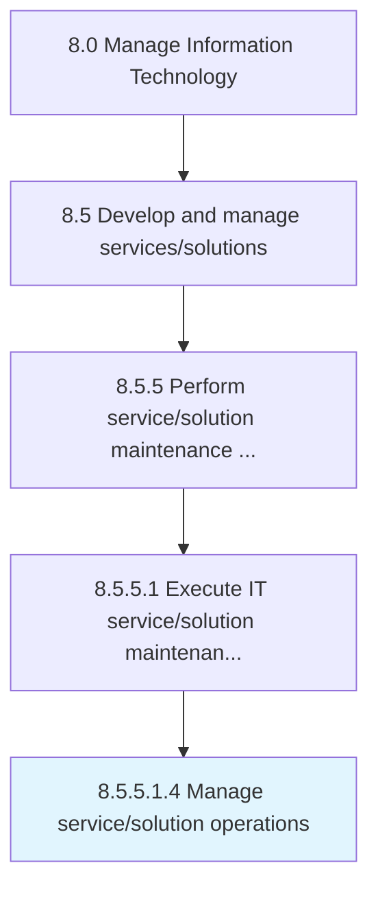

# Manage service/solution operations

> Understanding customer requirements.

## Overview

Sub-Activity 8.5.5.1.4 is an activity within the Manage Information Technology framework. 

Understanding customer requirements. Managing services/solutions based on the requirements. Develop components for providing the requirements. Train resources to provide support. Confirm the customer experience post-sale. Evaluate the performance of service/solution. Communicate the results to the management.

## Process Hierarchy



## Key Statistics

| Metric | Value |
|--------|-------|
| APQC Code | 20822 |
| Hierarchy ID | 8.5.5.1.4 |
| Level | Sub-Activity |
| Parent | [8.5.5.1](../) |
| Sub-Processes | 0 |


## GraphDL Semantic Structure

```
manage.ServicesolutionOperations
```

| Component | Value | Description |
|-----------|-------|-------------|
| Verb | `manage` | Primary action |
| Object | `service/solution operations` | Direct object |


## Related Concepts

- ServiceOperations
- SolutionOperations


---

*Source: APQC PCF 20822 (8.5.5.1.4) - APQC*
