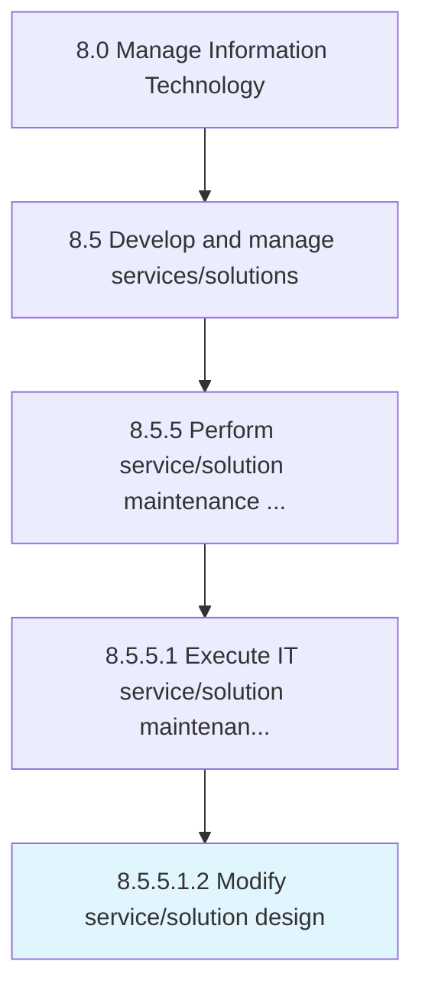

# Modify service/solution design

> Redesign the roadmap to seek solution or service with an overall process flow and impact timeframe.

## Overview

Sub-Activity 8.5.5.1.2 is an activity within the Manage Information Technology framework. 

Redesign the roadmap to seek solution or service with an overall process flow and impact timeframe.

## Process Hierarchy



## Key Statistics

| Metric | Value |
|--------|-------|
| APQC Code | 20820 |
| Hierarchy ID | 8.5.5.1.2 |
| Level | Sub-Activity |
| Parent | [8.5.5.1](../) |
| Sub-Processes | 0 |


## GraphDL Semantic Structure

```
modify.ServicesolutionDesign
```

| Component | Value | Description |
|-----------|-------|-------------|
| Verb | `modify` | Primary action |
| Object | `service/solution design` | Direct object |


## Related Concepts

- [ServiceDesign](/concepts/ServiceDesign)
- [SolutionDesign](/concepts/SolutionDesign)


---

*Source: APQC PCF 20820 (8.5.5.1.2) - APQC*
