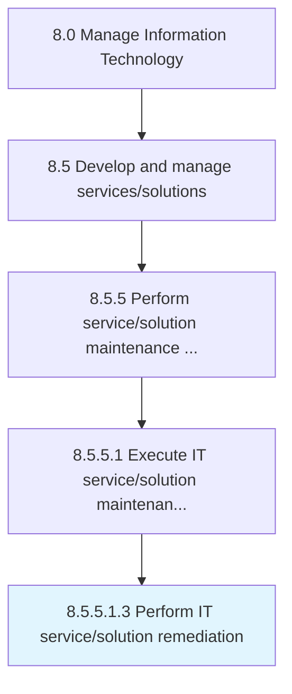

# Perform IT service/solution remediation

> Administering the efforts and activities for IT service/solution remediation.

## Overview

Sub-Activity 8.5.5.1.3 is an activity within the Manage Information Technology framework. 

Administering the efforts and activities for IT service/solution remediation. This process element requires the organization to create plans for corrective action in collaboration with government agencies and pertinent professional services agencies which specialize in remediation efforts relevant to the organization's service/solution. Additionally, the organization needs to consult experts to validate the plan, determine resources allocation, resolve any legal concerns, and formulate a company-wide policy for IT service/solution remediation.

## Process Hierarchy



## Key Statistics

| Metric | Value |
|--------|-------|
| APQC Code | 20821 |
| Hierarchy ID | 8.5.5.1.3 |
| Level | Sub-Activity |
| Parent | [8.5.5.1](../) |
| Sub-Processes | 0 |


## GraphDL Semantic Structure

```
perform.ITServicesolutionRemediation
```

| Component | Value | Description |
|-----------|-------|-------------|
| Verb | `perform` | Primary action |
| Object | `IT service/solution remediation` | Direct object |


## Related Concepts

- [ITServiceRemediation](/concepts/ITServiceRemediation)
- [ITSolutionRemediation](/concepts/ITSolutionRemediation)


---

*Source: APQC PCF 20821 (8.5.5.1.3) - APQC*
