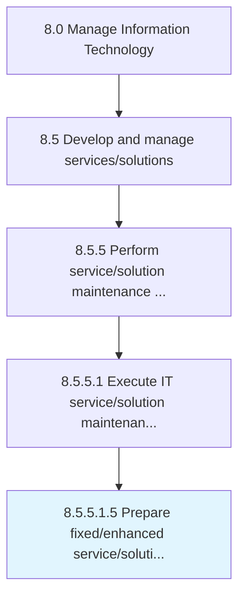

# Prepare fixed/enhanced service/solution packaging

> Developing packaging for fixed/enhanced service/solution based on the standalone or bundled offerings to be used by the organization.

## Overview

Sub-Activity 8.5.5.1.5 is an activity within the Manage Information Technology framework. 

Developing packaging for fixed/enhanced service/solution based on the standalone or bundled offerings to be used by the organization.

## Process Hierarchy



## Key Statistics

| Metric | Value |
|--------|-------|
| APQC Code | 20823 |
| Hierarchy ID | 8.5.5.1.5 |
| Level | Sub-Activity |
| Parent | [8.5.5.1](../) |
| Sub-Processes | 0 |


## GraphDL Semantic Structure

```
prepare.FixedenhancedServicesolutionPackaging
```

| Component | Value | Description |
|-----------|-------|-------------|
| Verb | `prepare` | Primary action |
| Object | `fixed/enhanced service/solution packaging` | Direct object |


## Related Concepts

- FixedPackaging
- EnhancedServicePackaging
- SolutionPackaging


---

*Source: APQC PCF 20823 (8.5.5.1.5) - APQC*
