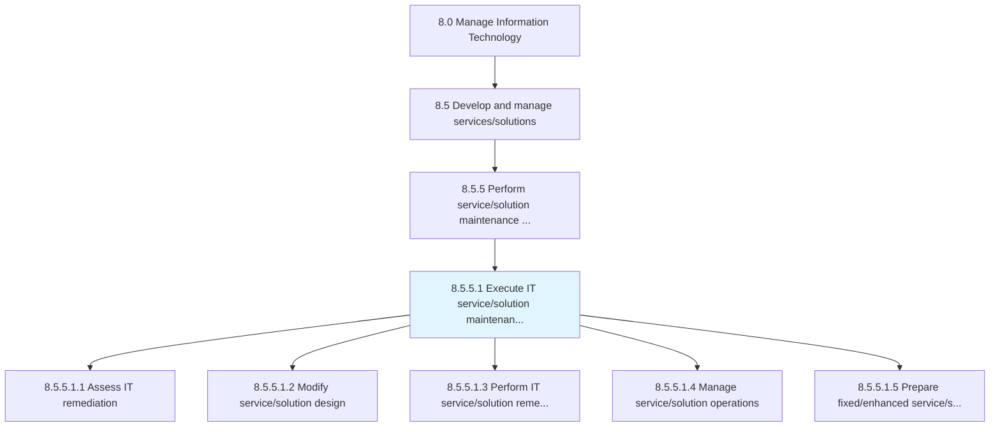
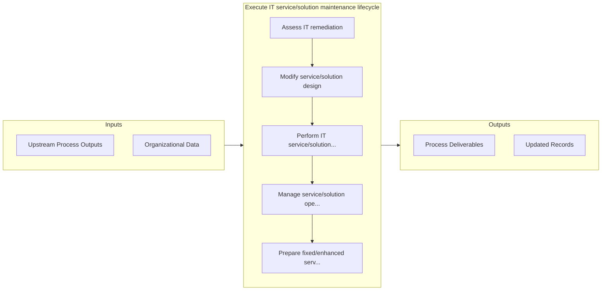

# Execute IT service/solution maintenance lifecycle

> Executing IT service/solution maintenance lifecycle in order to reduce maintenance costs and increase reliability of IT infrastructure concerning service/solution related problems.

## Overview

Activity 8.5.5.1 is an activity within the Manage Information Technology framework. 

Executing IT service/solution maintenance lifecycle in order to reduce maintenance costs and increase reliability of IT infrastructure concerning service/solution related problems.

## Process Hierarchy



## Key Statistics

| Metric | Value |
|--------|-------|
| APQC Code | 20818 |
| Hierarchy ID | 8.5.5.1 |
| Level | Activity |
| Parent | [8.5.5](../) |
| Sub-Processes | 5 |


## GraphDL Semantic Structure

```
execute.ITServicesolutionMaintenanceLifecycle
```

| Component | Value | Description |
|-----------|-------|-------------|
| Verb | `execute` | Primary action |
| Object | `IT service/solution maintenance lifecycle` | Direct object |


## Process Flow



## Sub-Processes

| Process | Hierarchy ID | Description |
|---------|-------------|-------------|
| [Assess IT remediation](./AssessITRemediation) | 8.5.5.1.1 | Evaluate plans to address information technology environmental adulteration for rectification effort |
| [Modify service/solution design](./ModifyServicesolutionDesign) | 8.5.5.1.2 | Redesign the roadmap to seek solution or service with an overall process flow and impact timeframe |
| [Perform IT service/solution remediation](./PerformITServicesolutionRemediation) | 8.5.5.1.3 | Administering the efforts and activities for IT service/solution remediation |
| [Manage service/solution operations](./ManageServicesolutionOperations) | 8.5.5.1.4 | Understanding customer requirements |
| [Prepare fixed/enhanced service/solution packaging](./PrepareFixedenhancedServicesolutionPackaging) | 8.5.5.1.5 | Developing packaging for fixed/enhanced service/solution based on the standalone or bundled offering |


## Related Concepts

- [ITServiceMaintenanceLifecycle](/concepts/ITServiceMaintenanceLifecycle)
- [ITSolutionMaintenanceLifecycle](/concepts/ITSolutionMaintenanceLifecycle)


---

*Source: APQC PCF 20818 (8.5.5.1) - APQC*
