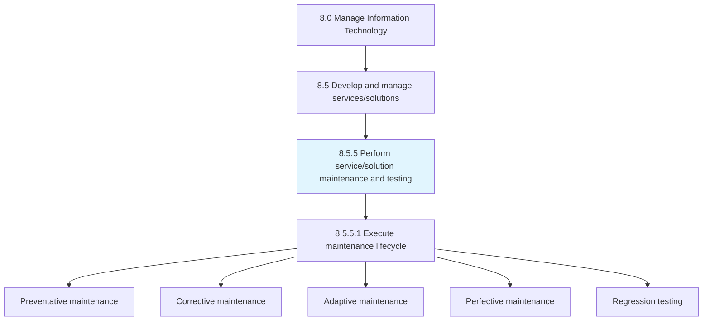
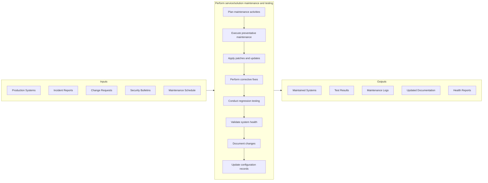
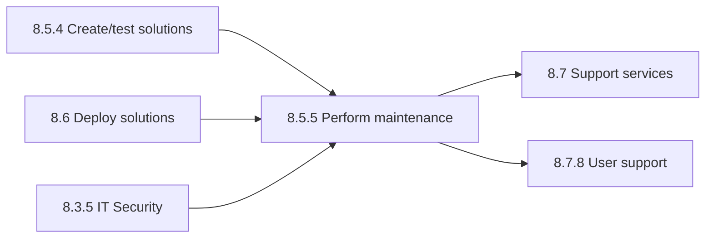

# Perform service/solution maintenance and testing

> Engaging in all aspects of service/solution maintenance and testing includes all preventative, routine, and corrective activates.

## Overview

Process 8.5.5 is a core process that defines the specific procedures for performing service/solution maintenance and testing. This process ensures the ongoing health, reliability, and performance of IT systems throughout their operational lifecycle.

Engaging in all aspects of service/solution maintenance and testing includes all preventative, routine, and corrective activities. Ensure that IT services/solutions are functioning properly and meet regulatory requirements where applicable.

Maintenance activities are critical for maximizing the value of IT investments, extending system lifespan, and ensuring continuous service availability. This process includes scheduled maintenance, emergency fixes, performance optimization, security patching, and regression testing.

## Process Hierarchy



## Key Statistics

| Metric | Value |
|--------|-------|
| APQC Code | 20817 |
| Hierarchy ID | 8.5.5 |
| Level | Process |
| Parent | [8.5](../) |
| Sub-Processes | 1 |
| Industry Variants | 19 |

## GraphDL Semantic Structure

```graphdl
perform.ServiceMaintenance
perform.SolutionTesting
execute.MaintenanceLifecycle
```

| Component | Value | Description |
|-----------|-------|-------------|
| Verb | `perform` | Primary action of carrying out maintenance |
| Object | `service/solution maintenance and testing` | Maintenance and QA activities |

## Process Flow



## Child Process Listings

### 8.5.5.1 - Execute IT service/solution maintenance lifecycle

Executing IT service/solution maintenance lifecycle in order to reduce maintenance costs and increase system reliability. This sub-process implements the full spectrum of maintenance activities.

**Key Activities:**
- Schedule and execute preventative maintenance
- Apply security patches and updates
- Perform bug fixes and corrective maintenance
- Implement performance optimizations
- Conduct adaptive maintenance for environment changes
- Execute regression testing
- Validate compliance requirements
- Update system documentation

[View Process Details](./8.5.5.1-ExecuteITServicesolutionMaintenance/)

## Maintenance Types

| Type | Description | Frequency |
|------|-------------|-----------|
| Preventative | Scheduled activities to prevent failures | Regular schedule |
| Corrective | Fixing identified bugs and issues | As needed |
| Adaptive | Modifications for environment changes | As triggered |
| Perfective | Enhancements to improve performance | Planned cycles |
| Emergency | Critical fixes for production issues | As required |

## RACI Matrix

| Activity | Maintenance Lead | QA Engineer | Release Manager | Operations Manager | Security Analyst | Change Manager |
|----------|-----------------|-------------|-----------------|-------------------|------------------|----------------|
| Plan maintenance activities | R | C | C | A | C | C |
| Execute preventative maintenance | R | I | I | A | I | C |
| Apply patches and updates | R | C | A | C | R | R |
| Perform corrective fixes | R | R | C | A | I | C |
| Conduct regression testing | C | R | A | I | I | I |
| Validate system health | R | R | C | A | C | I |
| Document changes | R | C | C | I | I | A |
| Update configuration records | R | I | C | A | I | R |

**Legend:** R = Responsible, A = Accountable, C = Consulted, I = Informed

## Metrics and KPIs

| Metric | Description | Target | Frequency |
|--------|-------------|--------|-----------|
| Maintenance Backlog | Number of pending maintenance items | <50 | Weekly |
| Patch Compliance Rate | Percentage of systems with current patches | >95% | Weekly |
| MTTR (Mean Time to Repair) | Average time to fix issues | <4 hours | Per incident |
| Regression Test Pass Rate | Percentage of regression tests passing | >98% | Per release |
| Maintenance Cost Ratio | Maintenance cost vs. total IT spend | <20% | Monthly |
| System Availability | Uptime during maintenance windows | >99.5% | Monthly |
| Technical Debt Reduction | Percentage of technical debt addressed | >10% | Quarterly |
| Security Vulnerability Age | Average age of unpatched vulnerabilities | <30 days | Monthly |
| Change Success Rate | Percentage of maintenance changes successful | >95% | Monthly |
| Documentation Currency | Percentage of documentation up to date | >90% | Quarterly |

## Related Departments

- [IT Operations](/departments/IT/Operations) - Maintenance execution
- [Quality Assurance](/departments/IT/QA) - Testing and validation
- [Information Security](/departments/IT/Security) - Security patching
- [Release Management](/departments/IT/ReleaseManagement) - Change coordination
- [Service Desk](/departments/IT/ServiceDesk) - Issue reporting
- [Configuration Management](/departments/IT/ConfigManagement) - CMDB updates

## Related Occupations

- [Software Developers](/occupations/Technology/Development/SoftwareDevelopers) - Corrective maintenance
- [Software Quality Assurance Analysts](/occupations/Technology/Quality/SoftwareQAAnalysts) - Regression testing
- [Database Administrators](/occupations/Technology/Database/DatabaseAdministrators) - Database maintenance
- [Network and Computer Systems Administrators](/occupations/Technology/Infrastructure/NetworkAdministrators) - System maintenance
- [Information Security Analysts](/occupations/Technology/Security/InformationSecurityAnalysts) - Security patching
- [Computer User Support Specialists](/occupations/Technology/Support/ComputerUserSupportSpecialists) - Issue triage

## Related Concepts

- ServiceMaintenance
- SolutionMaintenance
- Testing
- RegressionTesting
- SecurityPatching
- TechnicalDebt

## Related Processes



---

*Source: APQC PCF 20817 (8.5.5) - APQC*
