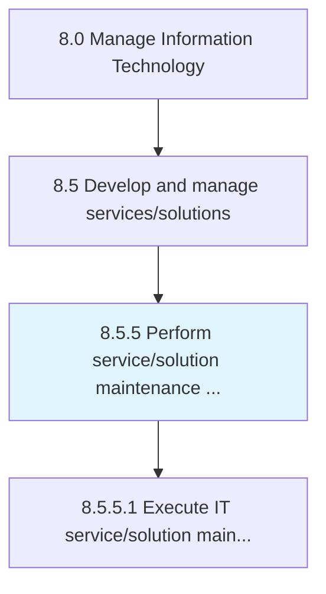
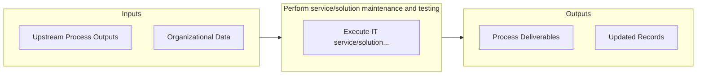

# Perform service/solution maintenance and testing

> Engaging in all aspects of service/solution maintenance and testing includes all preventative, routine, and corrective activates.

## Overview

Process 8.5.5 is a core process that defines the specific procedures for perform service/solution maintenance and testing. 

Engaging in all aspects of service/solution maintenance and testing includes all preventative, routine, and corrective activates. Ensure that IT service/solution are functioning properly and regulations where applicable.

## Process Hierarchy



## Key Statistics

| Metric | Value |
|--------|-------|
| APQC Code | 20817 |
| Hierarchy ID | 8.5.5 |
| Level | Process |
| Parent | [8.5](../) |
| Sub-Processes | 1 |


## GraphDL Semantic Structure

```
perform.ServicesolutionMaintenanceAndTesting
```

| Component | Value | Description |
|-----------|-------|-------------|
| Verb | `perform` | Primary action |
| Object | `service/solution maintenance and testing` | Direct object |


## Process Flow



## Sub-Processes

| Process | Hierarchy ID | Description |
|---------|-------------|-------------|
| [Execute IT service/solution maintenance lifecycle](./8.5.5.1-ExecuteITServicesolutionMaintenance/) | 8.5.5.1 | Executing IT service/solution maintenance lifecycle in order to reduce maintenance costs and increas |


## Related Concepts

- [ServiceMaintenance](/concepts/ServiceMaintenance)
- [SolutionMaintenance](/concepts/SolutionMaintenance)
- [Testing](/concepts/Testing)


---

*Source: APQC PCF 20817 (8.5.5) - APQC*
