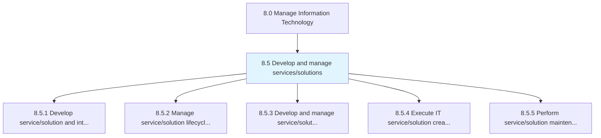
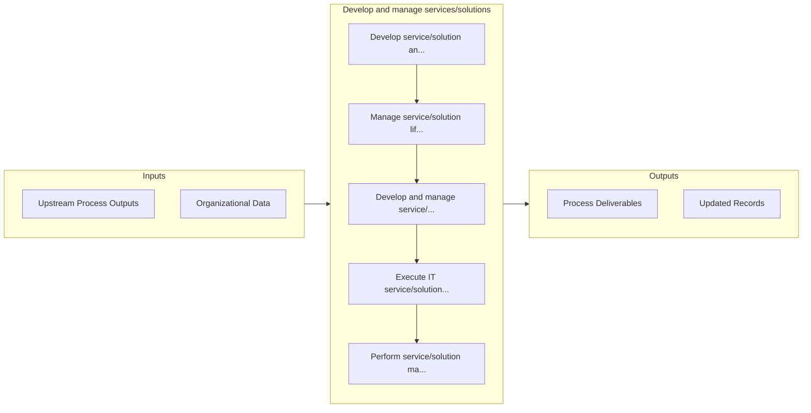

# Develop and manage services/solutions

> Designing and maintaining the IT services/solutions catalogue.

## Overview

Group 8.5 is a process group within APQC Category 8.0 (Manage Information Technology). 

Designing and maintaining the IT services/solutions catalogue. Evaluate the performance of IT services/solutions. Communicate the results to the management.

## Process Hierarchy



## Key Statistics

| Metric | Value |
|--------|-------|
| APQC Code | 20784 |
| Hierarchy ID | 8.5 |
| Level | Group |
| Parent | [8](../) |
| Sub-Processes | 5 |


## GraphDL Semantic Structure

```
develop.AndManageServicessolutions
```

| Component | Value | Description |
|-----------|-------|-------------|
| Verb | `develop` | Primary action |
| Object | `and manage services/solutions` | Direct object |


## Process Flow



## Sub-Processes

| Process | Hierarchy ID | Description |
|---------|-------------|-------------|
| [Develop service/solution and integration strategy](./8.5.1-DevelopServicesolutionIntegrationStrategy/) | 8.5.1 | Developing service/solution along with creating a strategy that provides a base for delivering servi |
| [Manage service/solution lifecycle planning](./8.5.2-ManageServicesolutionLifecyclePlanning/) | 8.5.2 | Executing life-cycle planning for IT services and solutions |
| [Develop and manage service/solution architecture](./8.5.3-DevelopManageServicesolutionArchitecture/) | 8.5.3 | Creating the architecture for the IT services and solutions |
| [Execute IT service/solution creation and testing](./8.5.4-ExecuteITServicesolutionCreation/) | 8.5.4 | Understanding customer requirements |
| [Perform service/solution maintenance and testing](./8.5.5-PerformServicesolutionMaintenanceTesting/) | 8.5.5 | Engaging in all aspects of service/solution maintenance and testing includes all preventative, routi |


## Related Concepts

- [Services](/concepts/Services)
- [Solutions](/concepts/Solutions)
- [Services](/concepts/Services)
- [Solutions](/concepts/Solutions)


---

*Source: APQC PCF 20784 (8.5) - APQC*
