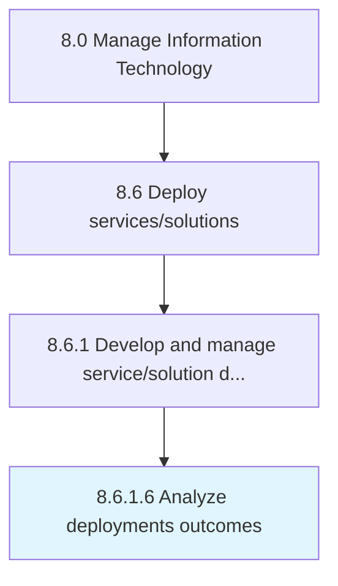

# Analyze deployments outcomes

> Evaluating the impact (pros and cons) of IT services deployment.

## Overview

Activity 8.6.1.6 is an activity within the Manage Information Technology framework. 

Evaluating the impact (pros and cons) of IT services deployment.

## Process Hierarchy



## Key Statistics

| Metric | Value |
|--------|-------|
| APQC Code | 20831 |
| Hierarchy ID | 8.6.1.6 |
| Level | Activity |
| Parent | [8.6.1](../) |
| Sub-Processes | 0 |


## GraphDL Semantic Structure

```
analyze.DeploymentsOutcomes
```

| Component | Value | Description |
|-----------|-------|-------------|
| Verb | `analyze` | Primary action |
| Object | `deployments outcomes` | Direct object |


## Related Concepts

- DeploymentsOutcomes


---

*Source: APQC PCF 20831 (8.6.1.6) - APQC*
