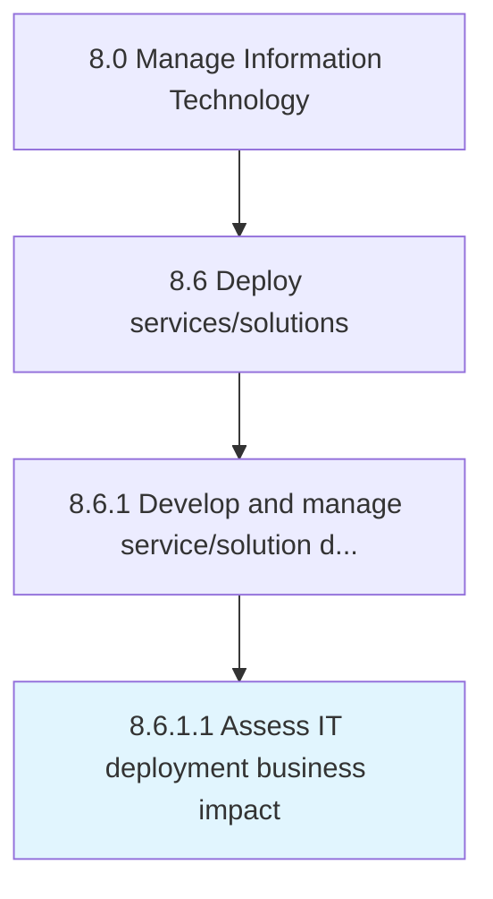

# Assess IT deployment business impact

> Evaluate the impact of IT deployment (products/services) on the business.

## Overview

Activity 8.6.1.1 is an activity within the Manage Information Technology framework. 

Evaluate the impact of IT deployment (products/services) on the business. Compare pre and post development performance, behavior of resources, and cost to assess organizational benefit.

## Process Hierarchy



## Key Statistics

| Metric | Value |
|--------|-------|
| APQC Code | 20826 |
| Hierarchy ID | 8.6.1.1 |
| Level | Activity |
| Parent | [8.6.1](../) |
| Sub-Processes | 0 |


## GraphDL Semantic Structure

```
assess.ITDeploymentBusinessImpact
```

| Component | Value | Description |
|-----------|-------|-------------|
| Verb | `assess` | Primary action |
| Object | `IT deployment business impact` | Direct object |


## Related Concepts

- [ITDeploymentBusinessImpact](/concepts/ITDeploymentBusinessImpact)


---

*Source: APQC PCF 20826 (8.6.1.1) - APQC*
