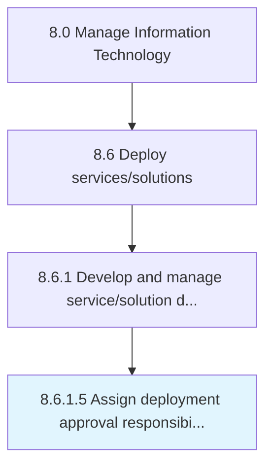

# Assign deployment approval responsibilities

> Coordinating development approval responsibilities based on defined change standards.

## Overview

Activity 8.6.1.5 is an activity within the Manage Information Technology framework. 

Coordinating development approval responsibilities based on defined change standards.

## Process Hierarchy



## Key Statistics

| Metric | Value |
|--------|-------|
| APQC Code | 20830 |
| Hierarchy ID | 8.6.1.5 |
| Level | Activity |
| Parent | [8.6.1](../) |
| Sub-Processes | 0 |


## GraphDL Semantic Structure

```
assign.DeploymentApprovalResponsibilities
```

| Component | Value | Description |
|-----------|-------|-------------|
| Verb | `assign` | Primary action |
| Object | `deployment approval responsibilities` | Direct object |


## Related Concepts

- DeploymentApprovalResponsibilities


---

*Source: APQC PCF 20830 (8.6.1.5) - APQC*
