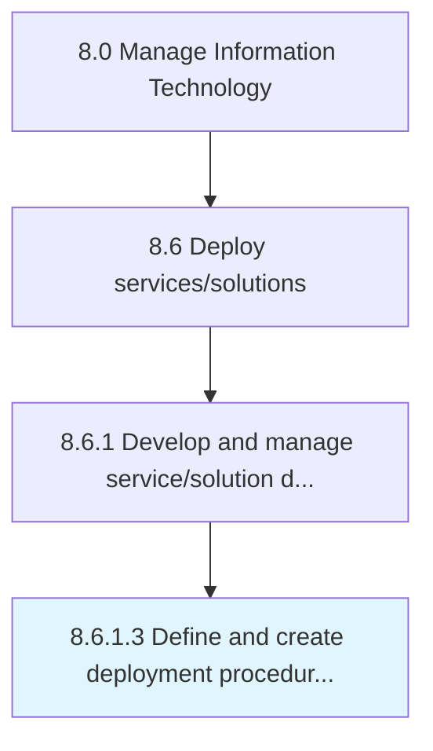

# Define and create deployment procedure workflow

> Outlining processes, methods, and equipment for deployment of IT solutions.

## Overview

Activity 8.6.1.3 is an activity within the Manage Information Technology framework. 

Outlining processes, methods, and equipment for deployment of IT solutions. Manage core operations servers like subversion server, production server, and development server, to make the IT services and solutions available for internal/client use.

## Process Hierarchy



## Key Statistics

| Metric | Value |
|--------|-------|
| APQC Code | 20828 |
| Hierarchy ID | 8.6.1.3 |
| Level | Activity |
| Parent | [8.6.1](../) |
| Sub-Processes | 0 |


## GraphDL Semantic Structure

```
define.AndCreateDeploymentProcedureWorkflow
```

| Component | Value | Description |
|-----------|-------|-------------|
| Verb | `define` | Primary action |
| Object | `and create deployment procedure workflow` | Direct object |


## Related Concepts

- [DeploymentProcedureWorkflow](/concepts/DeploymentProcedureWorkflow)
- [DeploymentProcedureWorkflow](/concepts/DeploymentProcedureWorkflow)


---

*Source: APQC PCF 20828 (8.6.1.3) - APQC*
