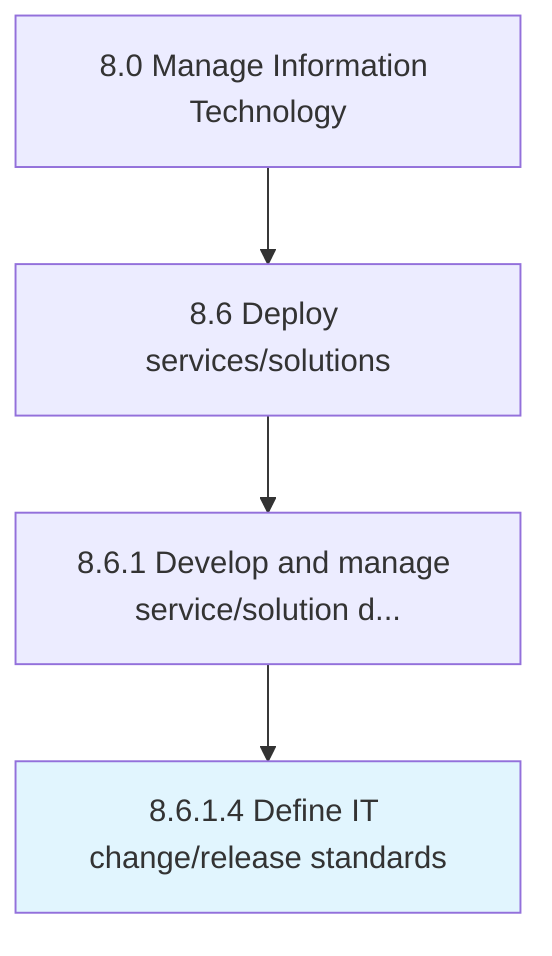

# Define IT change/release standards

> Establishing guidelines for the changed/released IT services and solutions to meet business objectives with optimum utilization.

## Overview

Activity 8.6.1.4 is an activity within the Manage Information Technology framework. 

Establishing guidelines for the changed/released IT services and solutions to meet business objectives with optimum utilization.

## Process Hierarchy



## Key Statistics

| Metric | Value |
|--------|-------|
| APQC Code | 20829 |
| Hierarchy ID | 8.6.1.4 |
| Level | Activity |
| Parent | [8.6.1](../) |
| Sub-Processes | 0 |


## GraphDL Semantic Structure

```
define.ITChangereleaseStandards
```

| Component | Value | Description |
|-----------|-------|-------------|
| Verb | `define` | Primary action |
| Object | `IT change/release standards` | Direct object |


## Related Concepts

- [ITChangeStandards](/concepts/ITChangeStandards)
- [ITReleaseStandards](/concepts/ITReleaseStandards)


---

*Source: APQC PCF 20829 (8.6.1.4) - APQC*
