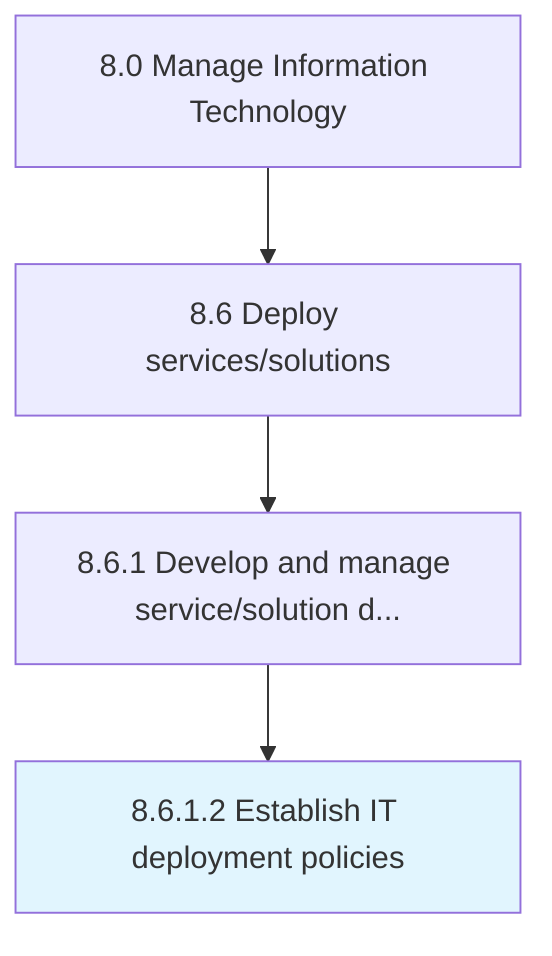

# Establish IT deployment policies

> Defining deployment policies regarding IT services and solutions to allow employees to plan accordingly.

## Overview

Activity 8.6.1.2 is an activity within the Manage Information Technology framework. 

Defining deployment policies regarding IT services and solutions to allow employees to plan accordingly. Reduce the negative impact to the user community.

## Process Hierarchy



## Key Statistics

| Metric | Value |
|--------|-------|
| APQC Code | 20827 |
| Hierarchy ID | 8.6.1.2 |
| Level | Activity |
| Parent | [8.6.1](../) |
| Sub-Processes | 0 |


## GraphDL Semantic Structure

```
establish.ITDeploymentPolicies
```

| Component | Value | Description |
|-----------|-------|-------------|
| Verb | `establish` | Primary action |
| Object | `IT deployment policies` | Direct object |


## Related Concepts

- [ITDeploymentPolicies](/concepts/ITDeploymentPolicies)


---

*Source: APQC PCF 20827 (8.6.1.2) - APQC*
