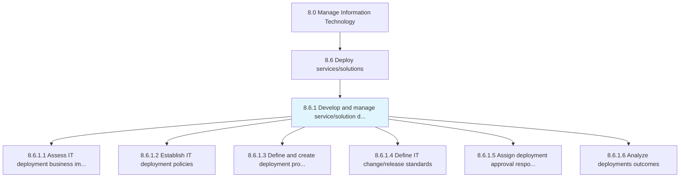
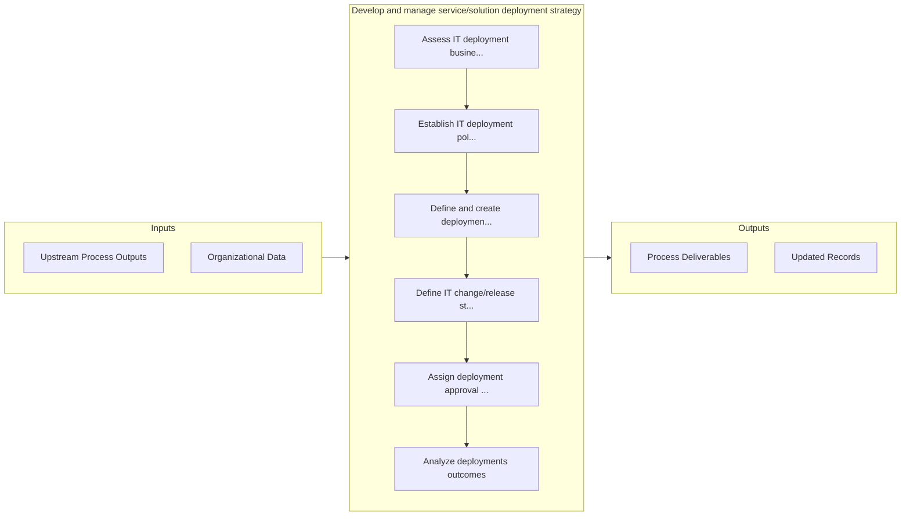

# Develop and manage service/solution deployment strategy

> Creating and implementing a strategy for the deployment of IT service/solution.

## Overview

Process 8.6.1 is a core process that defines the specific procedures for develop and manage service/solution deployment strategy. 

Creating and implementing a strategy for the deployment of IT service/solution. Define all of the activities that make the IT function available for use. Establish the change policies for IT services and solutions. Define the deployment process, procedures, and tools. Select the most feasible and practical methodologies for the deployment process.

## Process Hierarchy



## Key Statistics

| Metric | Value |
|--------|-------|
| APQC Code | 20825 |
| Hierarchy ID | 8.6.1 |
| Level | Process |
| Parent | [8.6](../) |
| Sub-Processes | 6 |


## GraphDL Semantic Structure

```
develop.AndManageServicesolutionDeploymentStrategy
```

| Component | Value | Description |
|-----------|-------|-------------|
| Verb | `develop` | Primary action |
| Object | `and manage service/solution deployment strategy` | Direct object |


## Process Flow



## Sub-Processes

| Process | Hierarchy ID | Description |
|---------|-------------|-------------|
| [Assess IT deployment business impact](./AssessITDeploymentBusinessImpact) | 8.6.1.1 | Evaluate the impact of IT deployment (products/services) on the business |
| [Establish IT deployment policies](./EstablishITDeploymentPolicies) | 8.6.1.2 | Defining deployment policies regarding IT services and solutions to allow employees to plan accordin |
| [Define and create deployment procedure workflow](./DefineAndCreateDeploymentProcedureWorkflow) | 8.6.1.3 | Outlining processes, methods, and equipment for deployment of IT solutions |
| [Define IT change/release standards](./DefineITChangereleaseStandards) | 8.6.1.4 | Establishing guidelines for the changed/released IT services and solutions to meet business objectiv |
| [Assign deployment approval responsibilities](./AssignDeploymentApprovalResponsibilities) | 8.6.1.5 | Coordinating development approval responsibilities based on defined change standards |
| [Analyze deployments outcomes](./AnalyzeDeploymentsOutcomes) | 8.6.1.6 | Evaluating the impact (pros and cons) of IT services deployment |


## Related Concepts

- [ServiceDeploymentStrategy](/concepts/ServiceDeploymentStrategy)
- [SolutionDeploymentStrategy](/concepts/SolutionDeploymentStrategy)
- [ServiceDeploymentStrategy](/concepts/ServiceDeploymentStrategy)
- [SolutionDeploymentStrategy](/concepts/SolutionDeploymentStrategy)


---

*Source: APQC PCF 20825 (8.6.1) - APQC*
