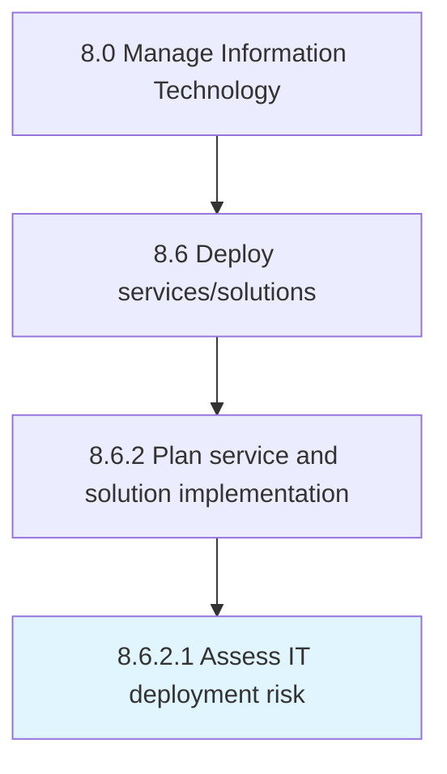

# Assess IT deployment risk

> Accessing threats and potential failures related to the deployment of IT services/solutions.

## Overview

Activity 8.6.2.1 is an activity within the Manage Information Technology framework. 

Accessing threats and potential failures related to the deployment of IT services/solutions.

## Process Hierarchy



## Key Statistics

| Metric | Value |
|--------|-------|
| APQC Code | 20833 |
| Hierarchy ID | 8.6.2.1 |
| Level | Activity |
| Parent | [8.6.2](../) |
| Sub-Processes | 0 |


## GraphDL Semantic Structure

```
assess.ITDeploymentRisk
```

| Component | Value | Description |
|-----------|-------|-------------|
| Verb | `assess` | Primary action |
| Object | `IT deployment risk` | Direct object |


## Related Concepts

- [ITDeploymentRisk](/concepts/ITDeploymentRisk)


---

*Source: APQC PCF 20833 (8.6.2.1) - APQC*
