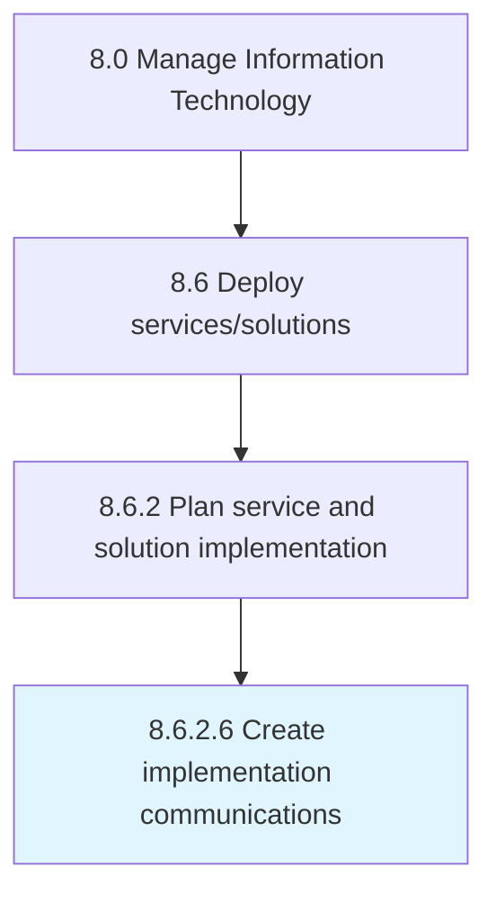

# Create implementation communications

> Coordinating change implementation in IT services and solutions communications with employees and stakeholders.

## Overview

Activity 8.6.2.6 is an activity within the Manage Information Technology framework. 

Coordinating change implementation in IT services and solutions communications with employees and stakeholders.

## Process Hierarchy



## Key Statistics

| Metric | Value |
|--------|-------|
| APQC Code | 20838 |
| Hierarchy ID | 8.6.2.6 |
| Level | Activity |
| Parent | [8.6.2](../) |
| Sub-Processes | 0 |


## GraphDL Semantic Structure

```
create.ImplementationCommunications
```

| Component | Value | Description |
|-----------|-------|-------------|
| Verb | `create` | Primary action |
| Object | `implementation communications` | Direct object |


## Related Concepts

- ImplementationCommunications


---

*Source: APQC PCF 20838 (8.6.2.6) - APQC*
